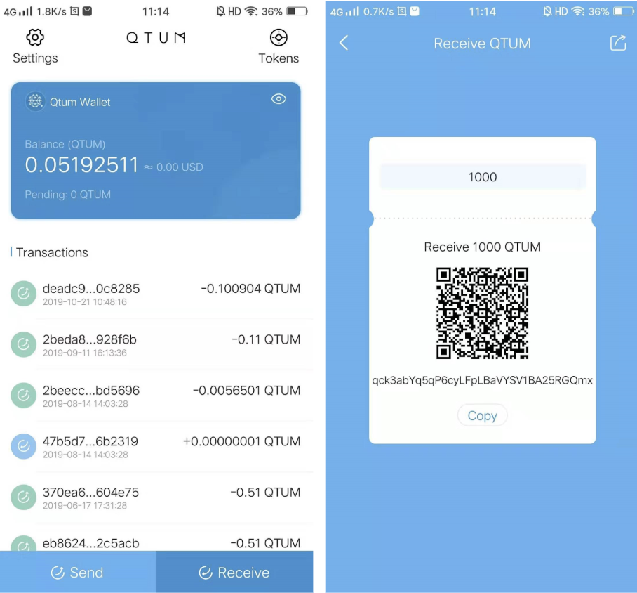
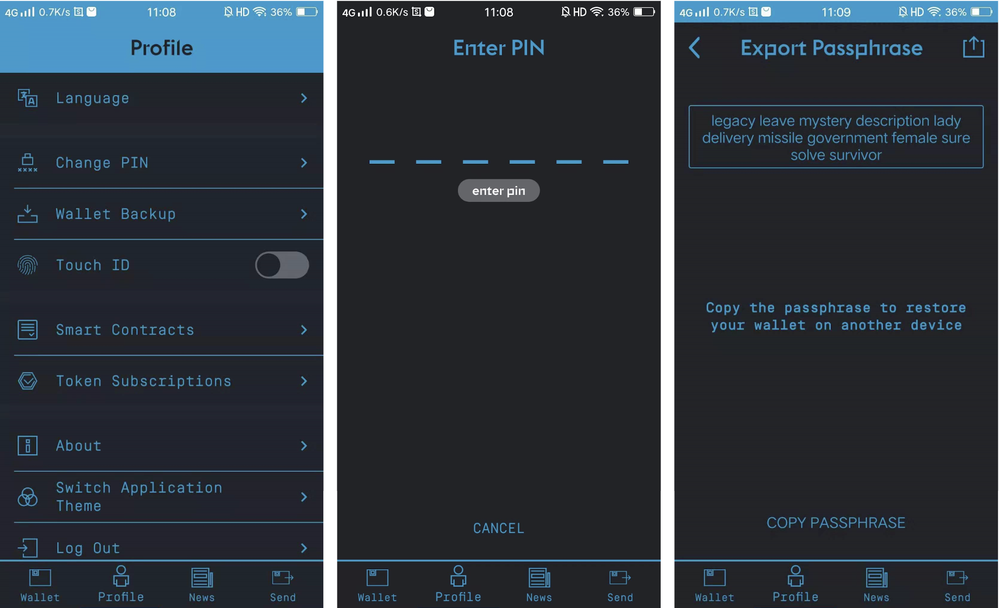

# Qtum Mobile Wallet (Android)

We have finally! updated our legacy Qtum Mobile wallet for Android, it was an overdue update and we're glad to have a new release which also looks great!.

# How to use the All-New Qtum Android Wallet

## 1. Create New Wallet
To use Qtum Wallet for the first time or create new Qtum Wallet, you could use the Create New button on the login page of the APP. In order to setup your wallet, you will need to enter your PIN twice, which will be used for logging in and making transactions later. Then, the system will randomly generate 12 seed words that are used to recover the wallet. These seed words should be kept safely and securely to avoid from being stolen. After backing up your seed words, you'll need to input them in the correct order to verify your account. After this, your wallet will be successfully created.

##2. Recover Wallet / Import Wallet
When you forget the transaction password of your Qtum Wallet, you can setup new transaction password by recovering your wallet. By using the Import Wallet function on the APP's login page, you can also import an existing wallet account when you switch your phone or change wallet application. There are two ways to import a wallet: 1. import seed words; 2. import private key. If you're importing seed words from a mobile or web wallet, the original transaction password will be needed as well. After importing your wallet successfully, enter your password twice and you'll complete the process.

##3. Send Cryptocurrency
Sending tokens in Qtum Wallet is very easy. You can find the send button on the bottom-left corner on the home page. There are three ways to input receiver's address: 1. copy and paste or input the address by hand (which is risky); 2. scan receiver's QR code, their address will be identified automatically by the wallet; 3. choose from the address book, which can be added using the home page's setup function. After entering amount and remarks, you need to tap the Next to confirm the transaction information. You can tap the Next after the transaction information is verified, and the transaction can be initiated by entering the password.

##4. Receive Cryptocurrency

Qtum Wallet supports receiving by QR code. Through the bottom-right receive button on the home page, you can enter the QR code setup page. Enter an amount, a QR code that will request a certain amount of QTUM coins will be generated automatically and ready to be shared with senders. Qtum wallet also supports traditional receiving method. By copying your wallet address and sending it to the sender, you'll allow other users to send to your address.

##5. Notes on Tokens
The tokens supported in Qtum wallet can be viewed through tapping the icon in the upper right corner of the home page. You can see the default tokens, such as QTC and QC, added in the wallet. You can add other tokens, such as BOT and INK, through tapping the "+" icon in the upper right corner of the token page. If the token you want to add is not found in the list of tokens, you can search the contract address to add it. In the token page, tap the specific token to enter the send page of the token, and you can see the past transaction record of the token.

##6. Old Wallet Backup
Tapping the "Profile" in the old version of wallet into the Settings Page, select the "Wallet Backup" function, by entering the PIN code you can see your wallet corresponding seed words and record them. For details of the recovery process in this Qtum Wallet, refer to the second section of the documentation, "Recover Wallet / Import Wallet".

