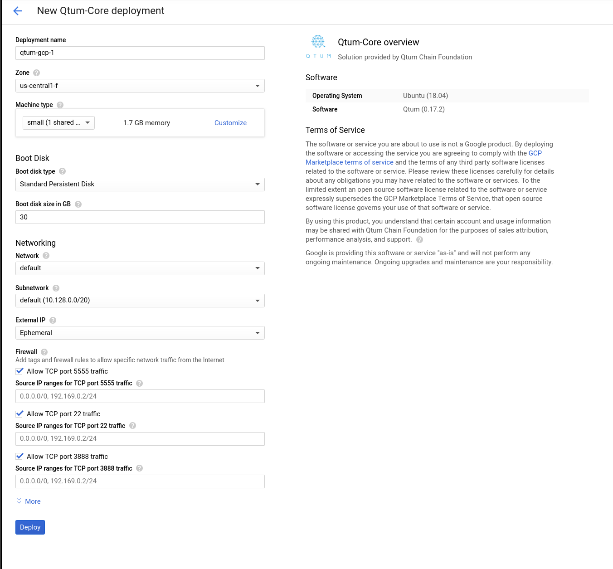
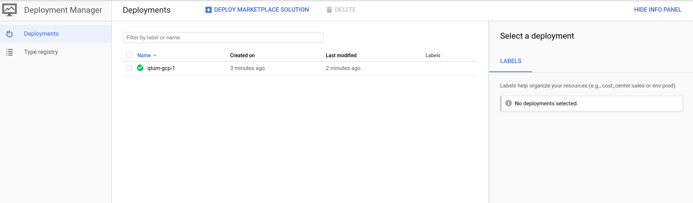
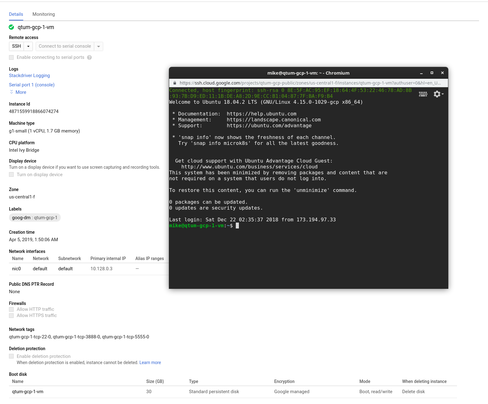

# How to deploy Qtum in Google Cloud marketplace

First, search for "Qtum-Core" or "Qtum" in the Google Cloud Marketplace. Once you find it, please click on "Launch on Compute Engine"

### Deploy Qtum Compute engine

Qtum isn't too hungry on resources, so you should be able to deploy a VM with only 1gb of ram and it'll work fine. Adding SWAP is always recommended to ensure further stability.

At the time of writing, the Qtum blockchain weighs 4.4GB, please choose at least 8GB for your disk.

### Qtum compute engine has been deployed 

Now our compute engine has been deployed and can be accessed via **ssh**.

All the tools are available and ready to use on first boot. You can configure permissions according to your needs.

