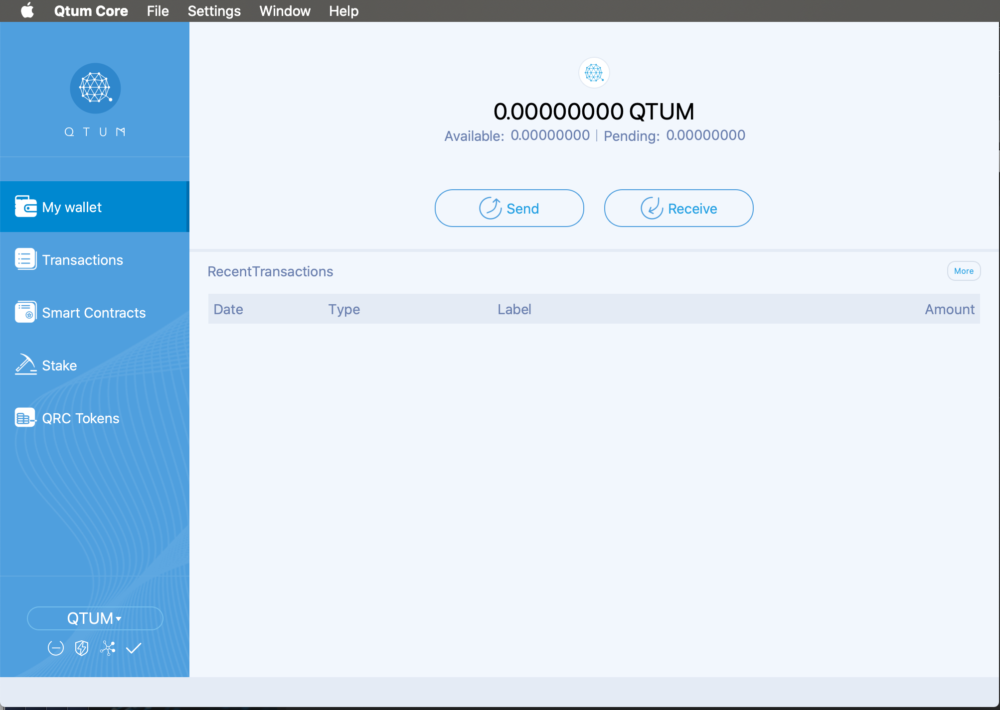
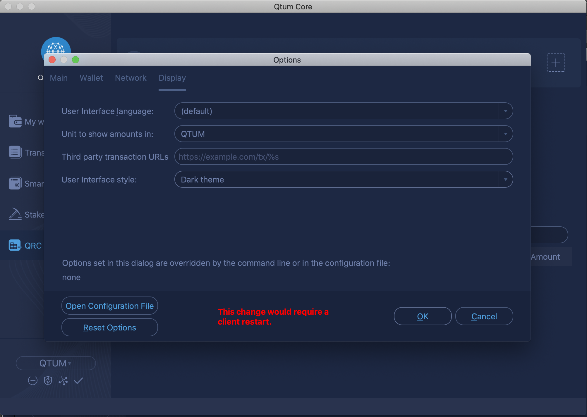
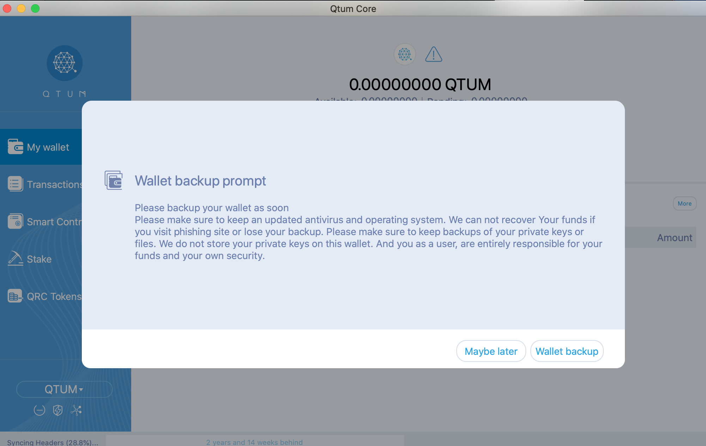
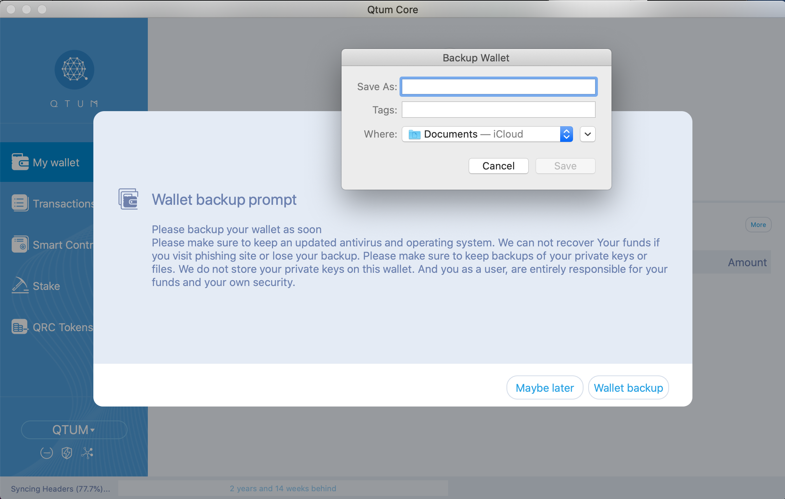
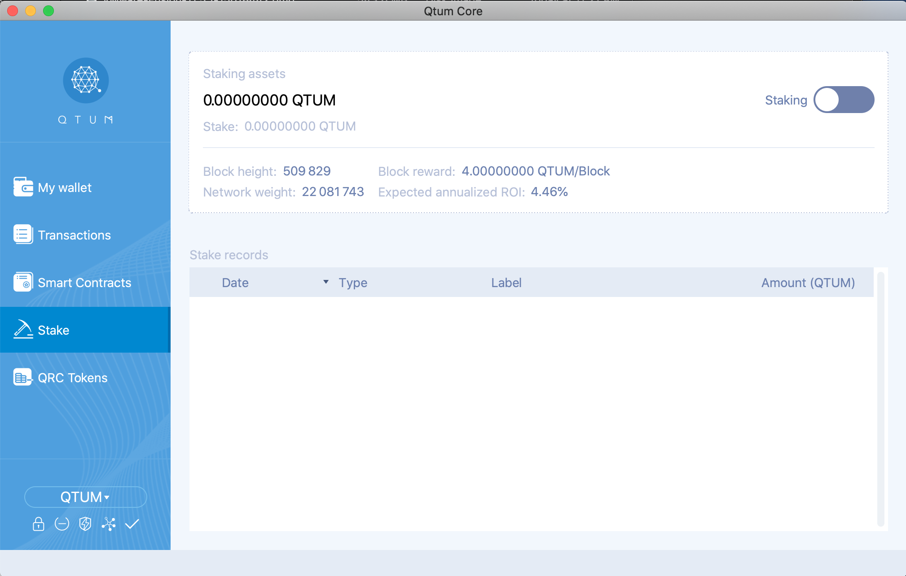
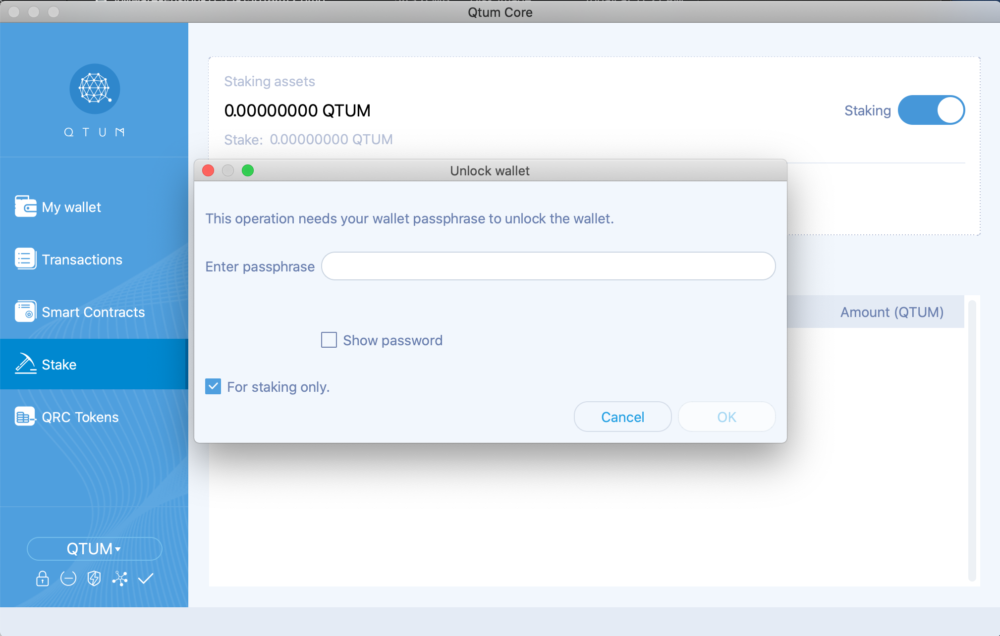

# Qtum 0.18.2 Overview

Every Qtum update brings new features and bug fixes, however, the 0.18.2 release stands out as one of the most interesting and exciting Qtum releases in the past two years. 

Here's some highlights of this new release:

- New UI, with different themes to choose from (Light, Dark Blue and Dark)
- New RPC calls added: `signrawsendertransactionwithwallet` and `signrawsendertransactionwithkey`
- Build fixes on some platforms
- Bug fixes 

Let's review the UI which changes the user experience completely:

# Themes

## Dark Blue

## Light Theme

## Dark Theme

# Switching Themes

Changing themes is a breeze, all we need to do is go to `Preferences -> Display` and choose the user interface style, once you choose the new style, click on "ok" and your wallet will restart with the new theme.

# Wallet Backup Reminder

Qtum 0.18.2 has a very useful wallet backup reminder, here's a couple of screenshots showing how it looks and works:

We get this reminder on when the wallet launches for the first time, we can decide to backup later or backup now (recommended).

You'll be asked where to save the wallet backup here

# Staking Button

Another new, cool feature about the 0.18.2 Qtum release is the Staking Button, it enables staking on your Qtum wallet by simply pressing the above button, if the wallet is encrypted, you'll be asked to unlock the wallet.

Here we unlock the wallet and decide if we want to fully unlock or unlock for staking only.