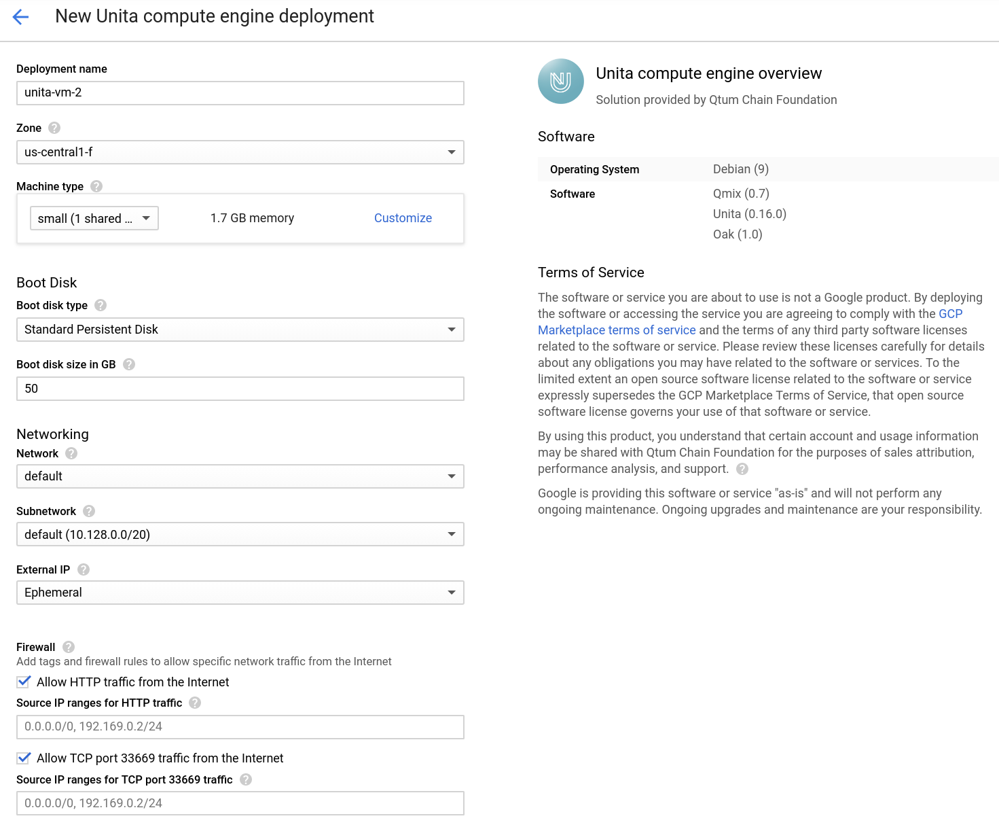
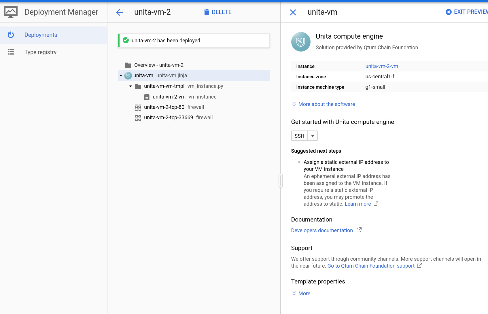
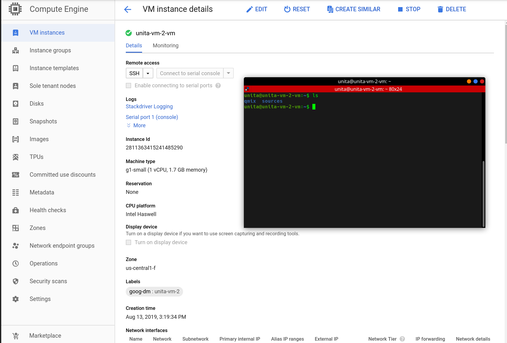
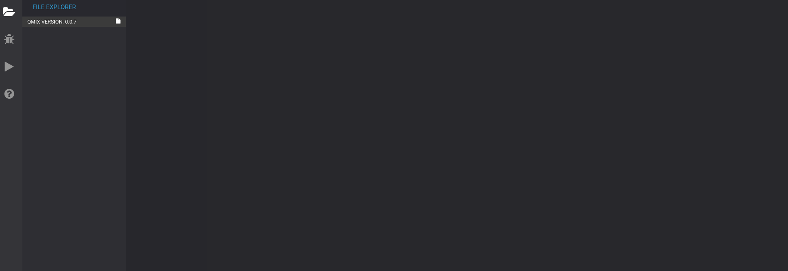

# How to deploy UNITA in Google Cloud marketplace

First, search for "Unita"in the Google Cloud Marketplace. Once you find it, please click on "Launch on Compute Engine"

### Deploy Unita Compute engine

Unita isn't too hungry on resources, so you should be able to deploy a VM with only 1gb of ram and it'll work fine. Adding SWAP is always recommended to ensure further stability.

At the time of writing, the Unita blockchain weighs 40MB, please choose at least 8GB for your disk.

### Unita compute engine has been deployed 

Now our compute engine has been deployed and can be accessed via **ssh**.

All the tools are available and ready to use on first boot. You can configure permissions according to your needs.

Make sure to add your ssh pubkey and the name "unita" at the end, this will create a username called unita on your Google Cloud deployment.

### Accessing Qmix

Qmix is launched automatically on boot, to access it, you need to go to http://gceinstanceip

More on Qmix: https://github.com/spacemanholdings/qmix

