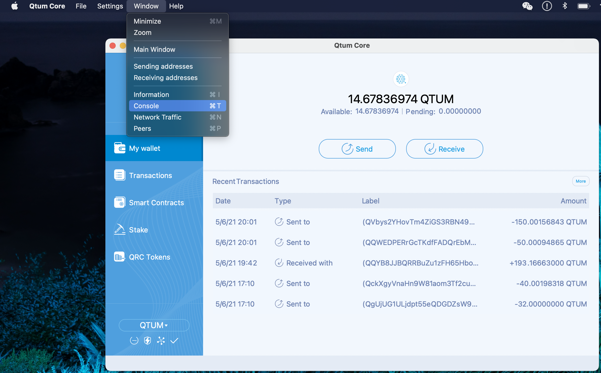
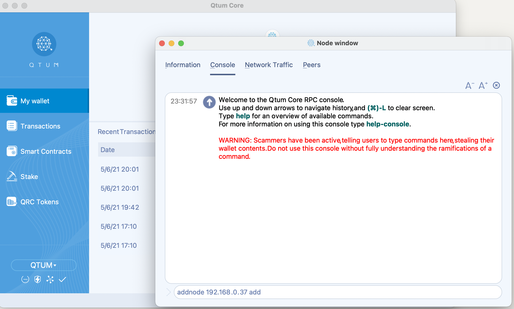
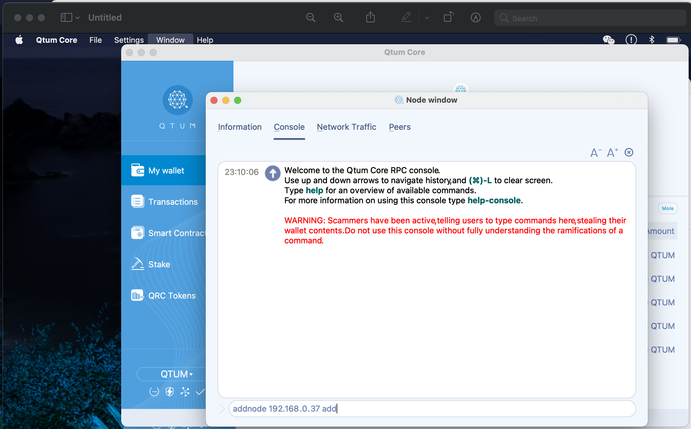
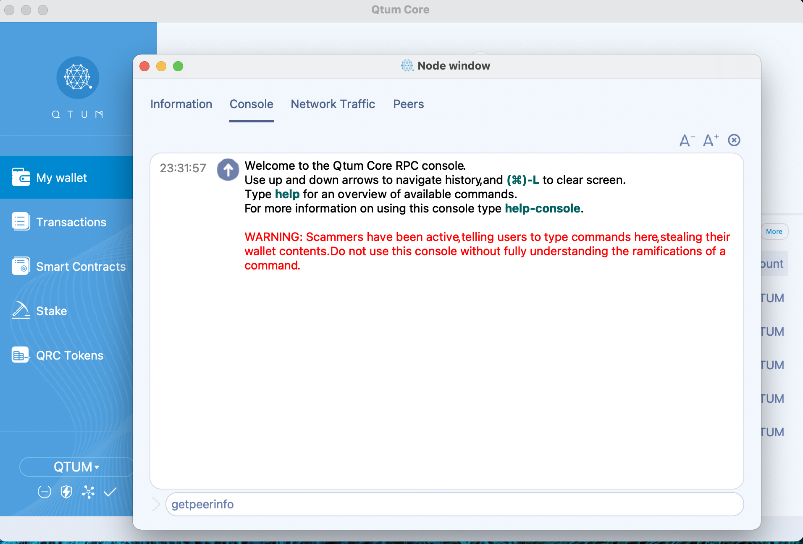
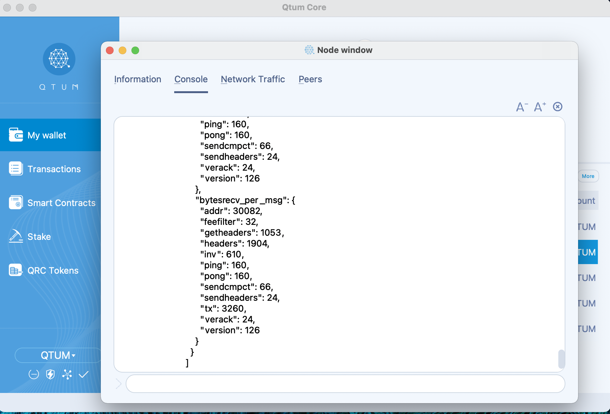

# Adding nodes

Adding nodes on Qtum is easy. First let's go to **Window -> Console**

Next, let's go to the "console" tab in the debug window and type `addnode ipaddress add` please remember to replace "ipaddress" with the node IP you want to add.

If successfull, you'll see a "null" reply on the console, this means we've added the node successfully 

You can always list all nodes your wallet is connected to by typing getpeerinfo on the console tab or by going to the Peers tab.

