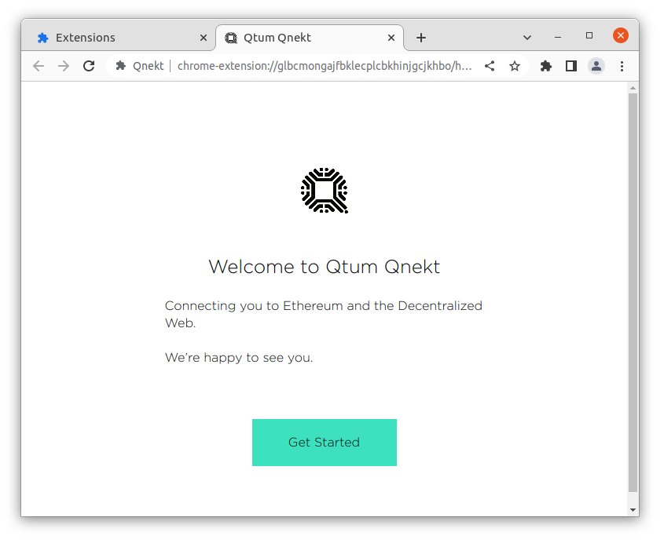
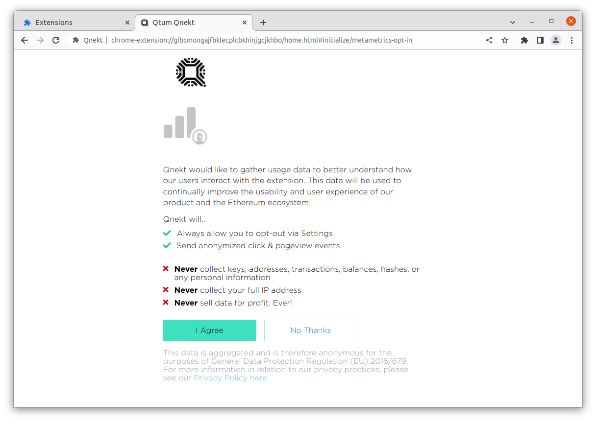
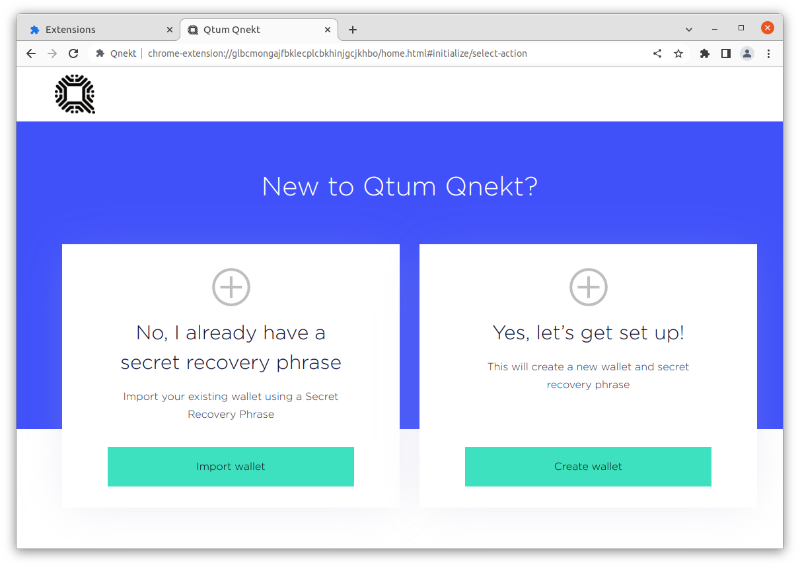
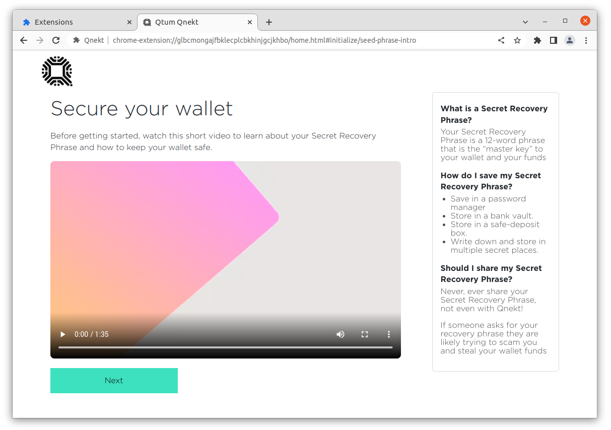
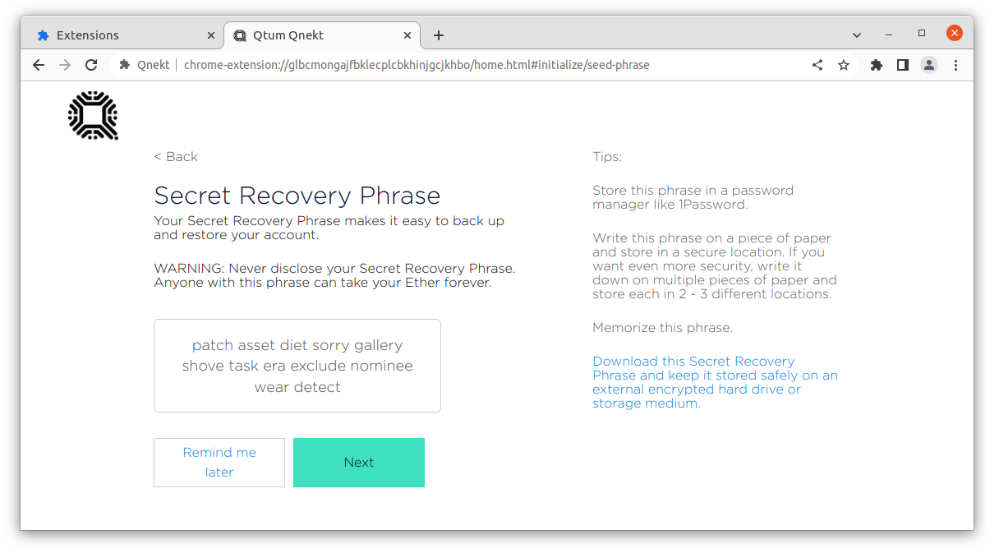

# First time setup

You should see a greeting

Optionally enable sending of analycis

If you already have a wallet you can use that, otherwise you can create a new one by following along

Optionally watch the video that explains what a wallet is

Write down your recovery phrase

And complete the challenge to confirm you have it written down

Congratulations, you have finished setting up your Qnekt browser wallet!

Now lets continue and get some testnet [Using Testnet Faucet](/Using-Testnet-Faucet/README.md)
