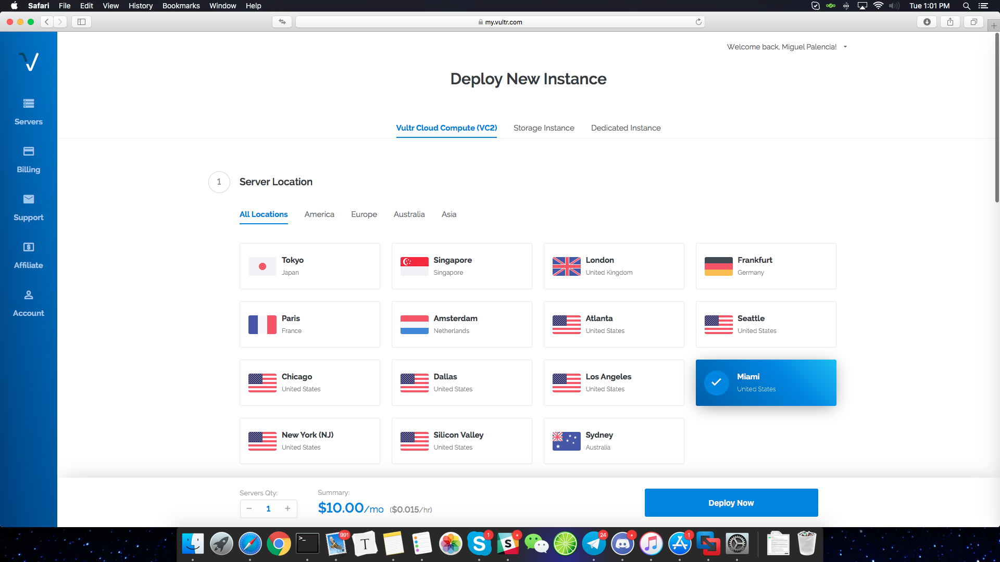
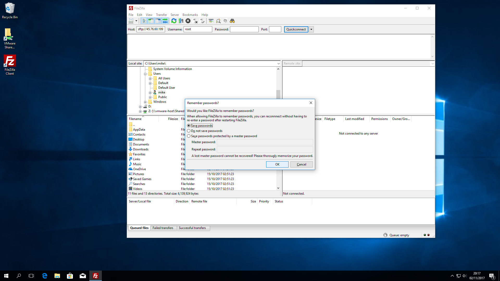

# Staking with a VPS

Many users prefer using a VPS for staking purposes, it is safer than using your local machine and it is more convenient for most people as you don't need to leave your computer turned on 24/7, there are also some very cheap and stable solutions you can use.

[You can also take advantage of the powerful solution we have at the AWS marketplace which is easier to setup and ready to go in just a few minutes!](https://aws.amazon.com/marketplace/pp/B07FB214D3)

In this tutorial we'll show how to do this using **Vultr**  https://vultr.com which is a very stable, cost effective and fast provider with instances all over the world, the same principles apply to any other cloud provider you may prefer.


## Launching instance


Let's begin, we log into our cloud provider dashboard where we get several options.



Choose a location for the VPS, for this test we've chosen Miami.


Choose a server type, our linux wallet runs on any linux distribution, however, it is recommended to use Ubuntu 16.04 if you want to compile the wallet yourself, (we'll do this on this tutorial). You can select any desired option, we went with a basic 1CPU/512MB ram VPS.


#### SSH Keys

It is recommended to use ssh-key to login instead of passwords, its far more secure and convenient.

Creating ssh-keys is out of the scope of this tutorial, but here are some good references on how to do this:

https://www.vultr.com/docs/how-do-i-generate-ssh-keys

https://www.digitalocean.com/community/tutorials/how-to-set-up-ssh-keys--2

https://docs.joyent.com/public-cloud/getting-started/ssh-keys/generating-an-ssh-key-manually/manually-generating-your-ssh-key-in-windows < *this one is for Windows users.*


After we've created our SSH key, we click on "add new"


Here we can paste our SSH-key, enter a name for it and click on add ssh key.


## Logging in to your VPS


Once we have our credentials ready, we log in and see the following screen:


### Install through repository (Ubuntu 16.04 -> 19.04, Debian and Linux Mint)

This is the recommended method for most users as it’s easier, faster and more convenient.
​

### Obtaining signing key

First, we need to obtain the Qtum signing key from the ubuntu keyserver, here's how:

``` sudo apt-key adv --keyserver keyserver.ubuntu.com --recv-keys BF5B197D ```

This will download and add the Qtum signing key to your linux install.

Adding repository to your APT sources.

``` sudo su - Sudo to root first

echo "deb https://repo.qtum.info/apt/ubuntu/ xenial main" >> /etc/apt/sources.list
```
This will add the repository to your APT sources file. NOTE: Please remember to change "xenial" for your Ubuntu version codename

Refreshing APT sources and installing Qtum

```
sudo apt update && sudo apt install qtum
```

By doing this, we'll update our sources and install Qtum on our ubuntu Box

To execute the daemon:

``` qtumd -daemon```

### Build on Ubuntu 16.04 and up


It's always good to refresh installed libraries, for that we do apt update && apt upgrade and just press enter when prompted. This will update all installed packages while also installing any available security updates.


Once we finish the update, let's proceed to installing dependencies and cloning the qtum sources from Github.


```

### Enabling SWAP

##### This step is necessary as most VPS don't come with SWAP enabled and it'll cause low-ram compilation errors, here's how to create SWAP.

dd if=/dev/zero of=/swapfile bs=1M count=2048
 chmod 600 /swapfile
mkswap /swapfile
swapon /swapfile
echo "/swapfile none swap defaults 0 0" >> /etc/fstab
This creates a 2GB swap file which will allow you to build and run Qtum without issues.

### Compiling Qtum

This is a quick start script for compiling Qtum on  Ubuntu


sudo apt-get install build-essential libtool autotools-dev automake pkg-config libssl-dev libevent-dev bsdmainutils git cmake libboost-all-dev
sudo apt-get install software-properties-common
sudo add-apt-repository ppa:bitcoin/bitcoin
sudo apt-get update
sudo apt-get install libdb4.8-dev libdb4.8++-dev

# If you want to build the Qt GUI:
sudo apt-get install libqt5gui5 libqt5core5a libqt5dbus5 qttools5-dev qttools5-dev-tools libprotobuf-dev protobuf-compiler

git clone https://github.com/qtumproject/qtum --recursive
cd qtum

# Note autogen will prompt to install some more dependencies if needed
./autogen.sh
./configure
make -j2
make install
```

Compiling Qtum takes a while, it depends a lot on your VPS resources, it can take anywhere from 3 minutes to 20+ minutes.

Once the process is finished, you'll have all qtum executables in /usr/local/bin/ you can check by typing

`ls /usr/local/bin/`


### Launching Qtum daemon

 `qtumd -daemon`  -> This launches the qtum daemon and the blockchain begins to synchronize right after launching. It can take some minutes before it's fully synced.

### Encrypting wallet

We can encrypt the wallet at any time, it's better to do it before we go any further.

To do this, type the following on the command line:

`qtum-cli encryptwallet yourpassword`

This will encrypt the wallet which in turn closes the daemon, you'll see the following message:

`wallet encrypted; Qtum server stopping, restart to run with encrypted wallet. The keypool has been flushed and a new HD seed was generated (if you are using HD). You need to make a new backup.`


`qtum-cli getaccountaddress ""` -> Right after launching the daemon, you can obtain your wallet address by typing this.

You can send Qtum coins to the address we just obtained from the daemon, please remember that those transactions require at least 500+ confirmations before they become mature enough for staking.


### Staking

Now that we've waited until we have at least 501 confirmations on our received transaction, we are elligible for staking, however, if our wallet is encrypted (which we did for security reasons) we won't be able to stake, let's open our wallet for staking using the command line!.

`qtum-cli walletpassphrase password 999999999 true`

The above command will unlock the walet **for staking only** for 31.6 Years! that should be enough for now. Please note, this will not unlock your backup, only the wallet that's running right now.

Now that we've unlocked our wallet, we need to wait until we have more than 501 confirmations to be elligible for staking, if we already do, it's a matter of time which will vary depending on the network weight vs your wallet's weight.

#### Checking Balance

To check your balance, type `qtum-cli getinfo` this will show general information, including your available balance and balance in staking

#### Check transactions

To check your transactions (incoming and outgoing) type `qtum-cli listtransactions`

#### Check staking info

To check Qtum's staking information, type `qtum-cli getstakinginfo`


### Staking tips

Staking really depends on network weight vs your wallet’s weight which is based on the amount of coins you have, higher weight increases your chances of staking a block.

If you have a large amount of coins, it’s a good idea to split those up in separate transactions, for instance, if you have 10.000 QTUM, it’s better to send 10 transactions of 1000 QTUM each to your wallet, each one generates a UTXO input which will take part in staking. This optimizes the staking process and works much better than just one large 10.000 QTUM input.

If you want to split your coins into different addresses inside your VPS wallet, type the following to obtain new addresses inside your wallet: `qtum-cli getnewaddress`
Each time you type this, you’ll get a new address, QTUM can generate any amount of addresses you want, but please keep in mind, if you do go over 100 new address, you might want to make a new backup of your wallet.


### Wallet Backup

Backing up your wallet from a Linux VPS is different from a desktop but not too complicated, there's several ways to do this, and here are some steps which should work on all major desktop OS.

First, we'll download Filezilla, which is an easy to use and secure FTP/SFTP server

https://filezilla-project.org


Installing is just like any other windows app.


When the installer finishes, we launch Filezilla and are greeted with this screen, let's proceed and add our previously created ssh-key

We go into Edit -> Settings -> SFTP. This will give us the following screen in which we will be able to import our SSH key.


Please note that Filezilla only accepts the private key which is created when the ssh-key was generated.

 Here we've already added the ssh key, now we can log into our server


we enter our VPS ip address + username (root in this case),  leave a blank password because we're using ssh-key to login 


Just press ok when prompted, and you'll be able to log in. 


Here we can see the /root/ folder of our VPS, this is where our wallet runs and has the wallet stored in /root/.qtum we can go ahead and double click the folder which will show us the following: 

Now all we need to do is scroll down to wallet.dat, right click and select download from the list. This will download the wallet.dat file to our computer, we've successfully backed up our Qtum wallet!.

# Updating wallet

### If you installed Qtum the old way (without using the repository)

We highly recommend using the repository from now on, however, if you still want to compile the wallet yourself, here’s how to upgrade:
**(Backup your wallet.dat first)**
`
cd ~/qtum/
git pull
./configure
make
qtum-cli stop
make install
qtumd -daemon
`
#### What happened there?
- We updated the sources from the original build folder (if you don’t have it anymore, you need to pull the entire repo as was shown in the beginning of this tutorial).
- We configured and built the new Qtum daemon
- We stopped the old daemon
- We installed the new daemon
- We executed the new daemon


### If you installed Qtum using the repo

If you used the repository to install your Qtum wallet, it’s very easy to upgrade to a new version, all you have to do is the following:


`apt update && apt upgrade`

This will update the apt sources on your Linux box and install the latest packages, Qtum included. If you only want to upgrade Qtum:

`apt update && apt install —only-upgrade qtum`
