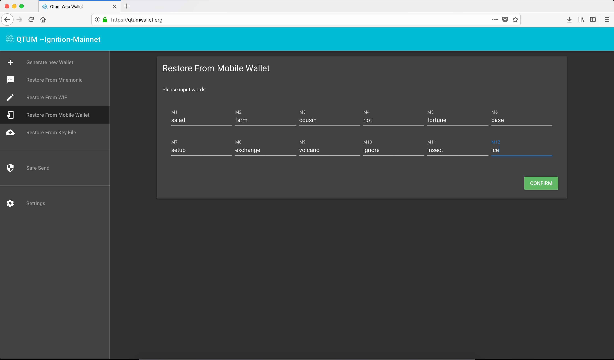

# QTUM Web Wallet

#### IMPORTANT!

When using a web wallet like this one, please make 100% sure that you're entering the right URL which is

https://qtumwallet.org

There is no other URL being used for the web wallet, please be safe.

Upong loading the web wallet, we get this very important warning, please take a few seconds and read it.

Now, let's click on **"generate new wallet"**

This is pretty straightforward, we will enter a password which will be used to create a series of of private keys based on the seed words which will be provided by the web wallet.

Please remember to back up these seed words, you and only you as a user have access to these seed words **(Private keys aren't stored on the server, if you lose these seed words you'll lose access to your funds!)**.

Here we're forced to enter the seed words manually to make sure we backed them up

This is our wallet, here we can see:

- Public key
- Balance
- Private key

You can always back up your private key itself, that's where your funds will go and it's very important. Please make sure to use paper backups

## Restore from backup

Restoring from backup is quite simple, however, please make sure to enter your password correctly **(the same one your entered when creating the wallet)** if you enter another password, the wallet will create a new address, so please make sure to enter the correct password.

Here we entered our seed words, and when we click on confirm we're prompted to enter the password, **AGAIN** please make sure to enter the correct password, otherwise the restore won't work.

We've successfully recovered the wallet, we can see here the address we had originally.

