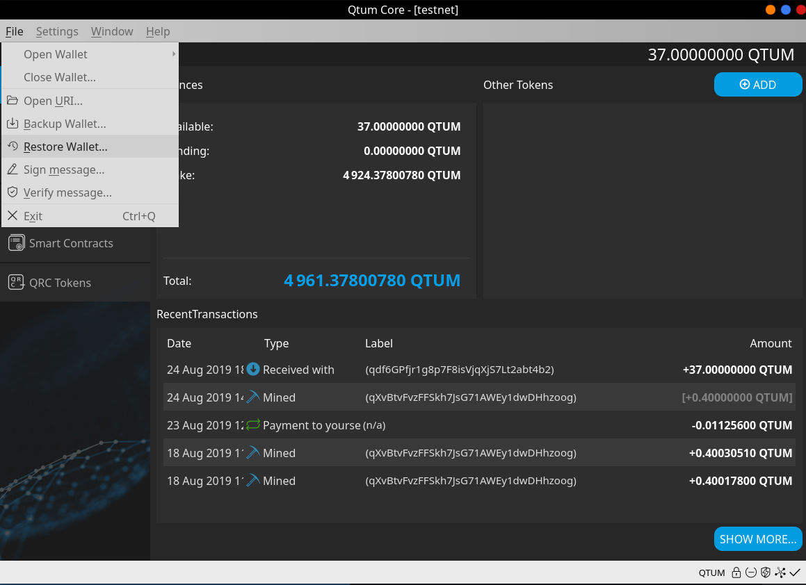

# Qtum QT Wallet Tutorial

### My Wallet

This is the Qtum wallet “**My Wallet**” page, it shows the following:

### Balances

- Available
- Pending
- Total

#### Other Tokens

If we own any tokens, they'll show here, including balance and contract info.

### Transactions  

This shows any transaction that may have taken place, both incoming and outgoing transactions are displayed, this includes staked coins as well.

## Basic wallet functions

On the left side of the wallet, we can find basic wallet functionality such as:

- Send
- Receive
- Smart Contract
- Transactions (This is a more detailed and full historical set of transactions)

## Send Menu

On the send menu, we have different functions, all are quite basic to learn and use.

**Pay to:** Here we’ll enter the address we want to send Qtum to **(Only Qtum ignition addresses will work).**

**Label:**  Optional, as it’s stated, it’s just a name/tag

**Amount: **Here we enter the amount of Qtum we want to Send

Once all fields are covered, we can click on the “Send” button and the Qtum coins will be sent to the address we entered above.

## Receive

Here we can display our Qtum wallet address and even generate new ones!

This is useful for receiving payments from more than one sender and helps you keep track of each transaction.

To obtain the deposit address, simply click on “Request Payment” and you’ll see a popup dialog show up with your Qtum wallet deposit address. Here you can receive coins from your exchange or from other users. For this tutorial, we’ll do a test deposit of 54.9 Qtum. 

## Transactions

Here you can see both incoming and outgoing transactions, shows every historical transactions.

## Wallet Encryption

First, let’s encrypt this wallet before making the backup, this will allow the backup to be encrypted as well. Go to settings -> Encrypt wallet.

Next, let’s enter the password for this wallet, **please remember this password because without it you’ll lose access to your Qtum**.

Lastly, we get a warning reminding us to save/remember this passphrase as there's no way to recover your Qtum without it

NOTE: On Qtum 0.18x, the wallet doesn't restart after encrypting. After you see the above message, the wallet is already encrypted and ready to use.

## Unlock Wallet

## Wallet Backup

It's recommended to make the backup **after** encrypting the wallet.

To access the backup option, we go into File/Backup Wallet and then we enter route and name.

After the backup’s name is entered and we’ve verified the route where the wallet is being saved to, we can click on save. Now we’ve successfully backed up our wallet.

## Restore wallet backup

Go to File -> Restore wallet, this will open a dialog which will allow us to restore directly from the Qtum-core QT wallet!

Here we selected the wallet backup with the reindex option selected (salvagewallet can also be used if necessary).

## Staking

In order for staking to take place we must:

1. Have a transaction with more than 500 confirmations on the blockchain
2. Unlock our wallet prior to staking (preferably before reaching 500 confirmations on your inputs).
3. Keep our wallet open at all times, otherwise even if our coins are matured, they won’t be able to stake.

Here’s how to unlock the wallet for staking only

**Remember to have your wallet open 24/7, if you close it, you won’t be able to stake**

**Please make sure “for staking only” is selected.**

## Access the console tab

On Qtum 0.18x, the  console tab can be accessed from the "Windows" menu, as shown here:

The console tab is incredibly useful, although it's mostly for advanced uses, it is a very powerful tool and can perform actions that aren't really possible using the graphical interface. 

This document https://docs.qtum.site/en/commands/ explains in a very clear way how to use the console tab.