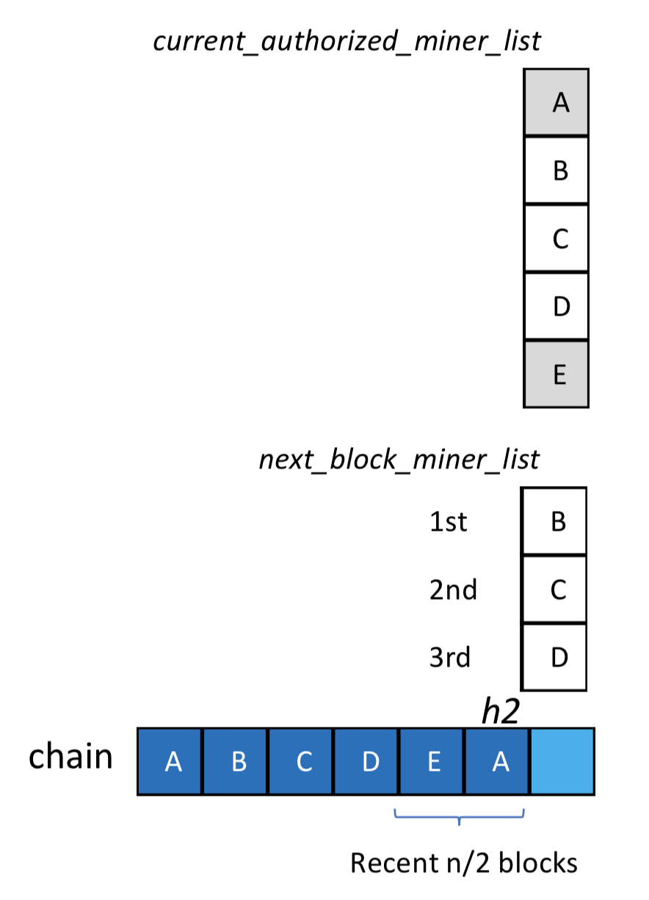

# SCAR：Scalable Consensus Algorithm

[点击获取pdf版](https://cloud2.qtum.org/s/8rwT2NQWF3j3MQE)

# Background

In order to reduce the fork attack and ensure the reliability of the blockchain network, the block intervals of some well-kown blockchain consensus algorithms, like PoS and PoW, are more than 10 seconds. For example: the  block time interval of Ethereum is 15 seconds, the Qtum is 144 seconds and the Bitcoin is 10 minutes. Howerver, the longer the block interval is, the longer the user will be waiting for the transaction confirmation. It is not good for real-time payment and some other applications.

Some consensus algorithms of the consortium blockchain, such as DPoS(Delegated Proof of Stake) [1] and Aura (Authority Round) [2] ,  reduce the block interval to less than 1 second by voting for the super node to execute the consensus algorithm. But the problem with this is that the number of blocks is too large, which puts a lot of pressure on network and storage. Running a full node, or even a light node that only downloads the block header, has high requirements on the performance of the node device.

For most commercial applications of blockchains, such as credit record and commodity tracking,  the write operations to blockchains are usually periodic. That is to say, the trading volume is large in hours of the day, and the trading volume is small in the remaining hours. For such a scenario, if the high-speed block output is always maintained, it is a big waste for the network and storage resources, and we only ensure that the system has higher performance during the peak hours of the network.

Therefore, we propose the SCAR (Scalable Consensus Algorithm). The idea of SCAR is to adjust parameters dynamically to find a balance between high performance and low load to achieve performance scalability.

# Related Work

PoW is represented by Bitcoin. The node provides computational power to generate new blocks through a large number of calculations. The higher the power is provided, the faster the block is generated. The calculation difficulty is adjusted every 2016 blocks, ensuring that the block time interval is kept at around 10 minutes in the case of a change in the overall network computing power. Since the block interval is long and the size of each block is limited to 1 MB. Therefore, the network will be seriously congested when the transaction volume is large.

PoS is represented by Qtum. The node provides a token and generates a new block with a small amount of calculation. The larger the token amount is, the faster the block is generated. The calculation difficulty will also be adjusted periodically to ensure that the block time interval is around 144 seconds. Compared with PoW, PoS is more energy efficient since it reduces the computational power requirements. However, since the block interval and the block size limit are still fixed, the load on the network is fixed, and it is impossible to avoid congestion when the transaction volume is large. Although Qtum can manually adjust the block size limit using the DGP(Decentralized Governance Protocol)[3] protocol, this approach is not easy enough.

In PoW and PoS, all nodes of the whole network will participate in the consensus competition, so the block interval cannot be set too small. If it is too small, it is easy to produce a fork. In other words, if the calculation difficulty is set too low, it is easy for a plurality of nodes to generate a new block at the same time.

The consortium blockchain consensus algorithm, such as DPoS and Tendermint, performs consensus by voting the super nodes. Since the number of nodes participating in the consensus is small, the block interval can be set small. For example, the EOS block interval is set to 0.5s. Too short a block interval is a great pressure on bandwidth and hard disk, and it will lead to waste of resources when the transaction volume is small. Since the launch of EOS on June 9 this year, the number of blocks has reached 12 million, but Bitcoin, which started 9 years ago, has only 500,000 blocks.

# Algorithm Description

An implementation of the SCAR algorithm will be described below. Based on the consortium blockchain, this algorithm dynamically updates the block interval by the transaction volume. It should be noted that the core idea of the SCAR algorithm is to dynamically adjust the performance of the blockchain according to the network load, so the implementation is not limited to the one proposed in this paper, and more implementations need to be further explored.

There are three steps in SCAR:
>   1.	Count all votes to get the super nodes.
>   2.	Calculate the block interval based on the network load.
>   3.	When the interval is over, each super node try to generate a block according to the priority. Once a new block is generated, return to step 1.

The advantages of the SCAR:
>   1.	Consensus is implemented by the super nodes, the block interval can be greatly shortened, and the transaction confirmation is faster.
>   2.	The block interval is dynamically adjusted according to the network load. When the network load is reduced, the block interval becomes longer. It will reduce the bandwidth and hard disk pressure.
>   3.	When less than half of the super nodes are fail, the new block can still be produced, and the system is still robust.

The detail of three steps of the SCAR algorithm will be described separately below.

## Vote for super nodes

There are many ways to vote for super nodes. For example, in EOS all users can vote,  and in Aura current super nodes can vote for super nodes of next round. Here we propose a voting strategy based on the Qtum DGP protocol.

When a new blockchain is initialized, the DGP's smart contract is deployed on the chain, and all admins (administrators) and govs (governors) are initialized in the contract. They are stored in the form of addresses. The DGP protocol supports on-chain voting by these admins and govs to determine if the super nodes should be updated.

First, we will introduce the permissions and modification strategies of the admins and govs. The admins have the highest power to determine the authority. The admins can participate in voting to add and delete admins, govs and super nodes; and the govs can only vote for super nodes. 

The voting process is as follows:
>   1.	Collect new super node proposals, publish to the community and collect feedback;
>   2.	Adjust the list of super nodes based on community feedback and store them in the blockchain through smart contracts as a new proposal;
>   3.	Call the corresponding method of the DGP contract to set the proposal to be voted, and the voting is started at this time;
>   4.	Every admin and gov votes on the proposal by sending a transaction to the voting contract;
>   5.	If the proposal does not receive enough votes, it will be rejected and no amendments will be implemented;
>   6.	If the proposal passes, the storage address of the new super node list will be recorded in the DGP contract and will take effect after a certain number of blocks to prevent unnecessary forks.
>   7.	Every node can get the latest list of super nodes through the DGP contract.

In summary, we can deploy DGP contract on the blockchain, determine the super nodes by DGP voting. And then, we can store and update the list of authorized nodes dynamically .

## Block interval

The interval of the block needs to be dynamically adjusted according to the load of the network. When the network is busy, the interval becomes shorter. We propose a calculation method of block interval in this paper, which is calculated according to the number of recent transactions. 

The formula for calculating the block interval is as follows:

In this formula, min_interval is the minimum block time interval, and max_interval is the maximum block time interval. transaction_num is the average number of transactions in the last m blocks, and m can be an integer greater than or equal to 1. These parameters (m, min_interval, and max_interval) are pre-set by consensus algorithms or smart contract.

The meaning of this formula is:
>   1.	When the transaction_num is 0, the block interval will be adjusted to max_interval. At this time, the maximum interval set by the system will be used to pack transactions in one block as much as possible. It can avoid waste of storage resource;
>   2.	When the transaction_num tends to infinity, the block interval will infinitely approach min_interval, and the shortest interval set by the system will be used to ease the transaction congestion of the blockchain network as much as possible.
>   3.	max_interval and min_interval can be set according to the actual situation (such as user tolerated transaction delay, super node network environment and storage performance, etc.).

By using the consensus algorithm SCAR, which dynamically adjusts the block time interval of the blockchain according to the network load, it can effectively avoid wasting storage resource when the transaction volume is small; also it can increase the block generation rate when the transaction volume is large, package the transaction into the blockchain in time, and guarantee the transaction to be confirmed quickly. The dynamic adjustment of the parameters on the chain also makes the blockchain system more flexible, improves governance efficiency, and reduces the difficulty and cost of governance.

## Generate block

After the super node and block interval are determined, the node can take turns to generate a new block after the interval.

At a specific blockchain height, if the number of super nodes is n, SCAR will assign a different block time to each super node. Block_time is as follows:

In this formula, parent_block_time is the block time of the previous block and block_interval is dynamically calculated. timeout is used to prevent some super nodes from failing to be out of the block for a long time. The miner_index is the index value; under the same block height, different authorization nodes have different miner_index. The specific reasons and uses of the parameter settings will be explained below.

As shown in the following figure, assume that there are 5 authorized super nodes A, B, C, D, E, their public keys are stored in a ordered list, which is determined by the DGP vote mentioned above. Assume that at height h1, the ordered miners list is [pubkey_A, pubkey_B, pubkey_C, pubkey_D, pubkey_E], and the five supernodes will create new blocks in turn.

When a new block is created, the miners sign the block with an encryption algorithm and then append the signature to the block. In this way, other nodes can recover the miner's public key from the block by decryption, thereby verifying whether the miner has the right to create a block by comparing with the super node list. When a chain is signed by the majority of miners, the chain can be viewed as a permanent chain. For example, in the above image, the chain from the genesis block to the height of h3 is a permanent chain because it has been signed by miners D, E and A. If any miner wants to make a fork under height h3, this fork cannot be followed by most miners.

Consensus algorithms can  avoid forks effectively, but at least n/2+1 super nodes need to keep the consensus algorithm running (n is the number of super nodes, n/2 is integer division). The consensus algorithm defines the miners who are allowed to create the next block:

A miner can create a new block in the following situations:

>   1. It is authorized currently;
>   2. The last n/2 blocks were not created by it.

From the above definition, which super node can generate a new block: the node signed for the nearest n/2 blocks can be removed from the current miner list. For example, at the block height h2, the list of miners in the next block is calculated as shown.

After selecting the three nodes (B, C, and D) that can generate the next block, we only need to set the super node list as an ordered list, and specify their priority order to avoid them competing for the next block of production.  The miner_index in the formula is the priority index of the sorted miners list. The super node with a higher order will be assigned a earlier block_time, and then each super node will use the allocated block_time to create a new block and keep wait before the block_time is over.

However, the super-node mode of the consortium blockchain also faces a problem: the failure of some nodes will lead to a sudden drop in network efficiency. In order to avoid the failure of some nodes, we add the following strategy to make sure the network works. We set timeout in the system parameters. If a super node fails to broadcast a new block due to a failure, the next super node will replace it after the timeout time and generate the block. As shown in the figure below, in the case of the above five super nodes, Miner B fails when producing a block with a height of h2+1. Subsequently, B's next node C in the supernode list will broadcast the new block it created after its block_interval+timeout time of parent_block_time.

# Conclusion

While ensuring the performance of the blockchain, SCAR saves network bandwidth and hard disk consumption as much as possible by adjusting the parameters on the blockchain dynamically. It is more efficient and flexible than other consensus algorithms, and has more advantages in large-scale commercial applications.

# References

[1] EOS.IO Technical White Paper v2: Consensus Algorithm (BFT-DPOS). https://github.com/EOSIO/Documentation/blob/master/TechnicalWhitePaper.md, March 16, 2018

[2] Aura - Authority Round - Wiki. https://wiki.parity.io/Aura

[3] Qtum区块链指南. https://docs.qtum.site/zh/Qtum-Blockchain-Guide.html

