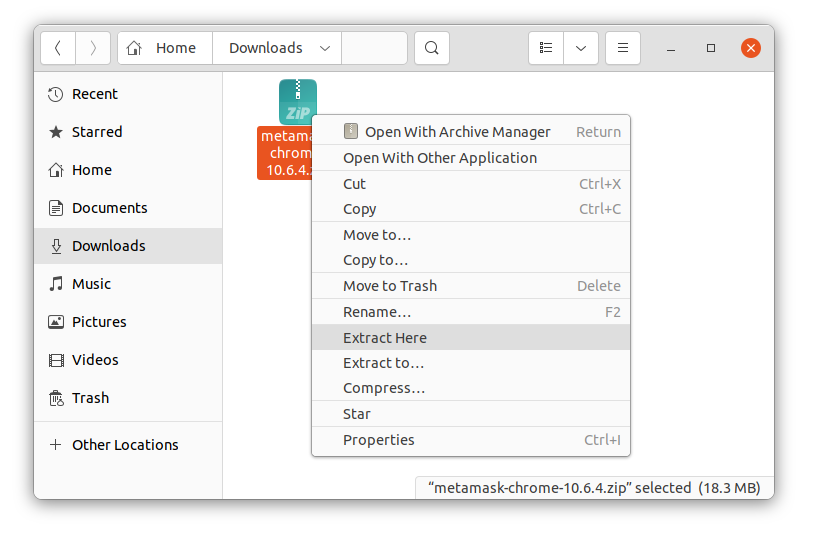
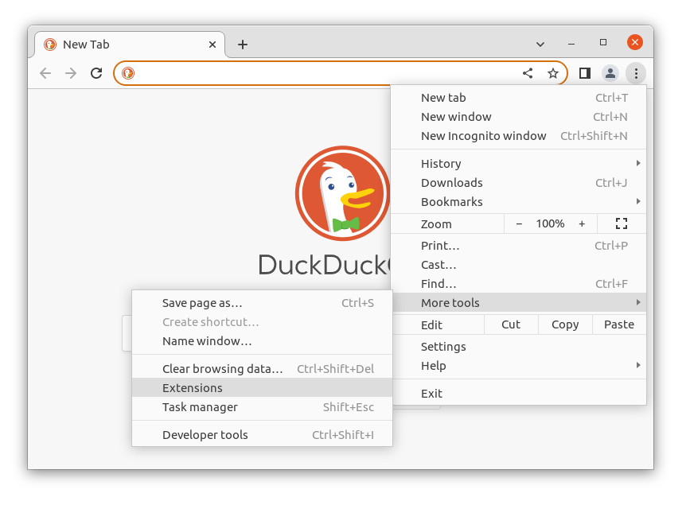
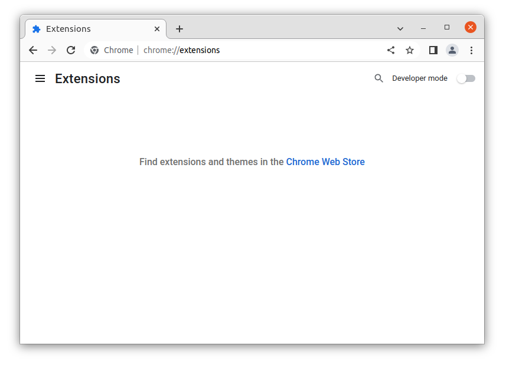
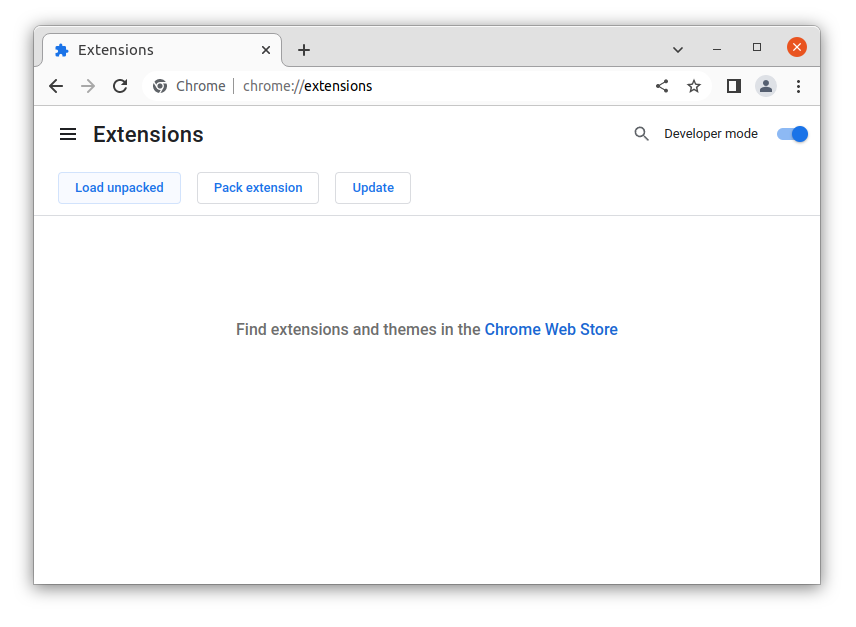
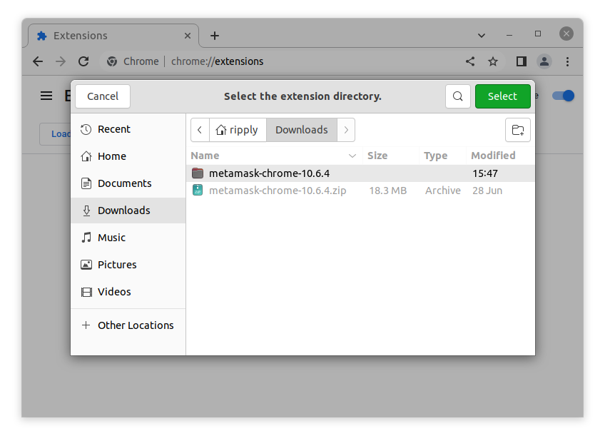

# Sideloading Qnekt Browser Extension

Download the latest release from [Github](https://github.com/earlgreytech/metamask-extension/releases)

Extract the zip file to a folder

Then open your browser and navigate to extensions

Enable Developer mode at the top right

Click Load unpacked

Navigate to the folder you extracted the zip file you downloaded

You have successfully sideloaded a browser extension

Next step is to do the [first time setup](/First-Time-Setup/README.md)
