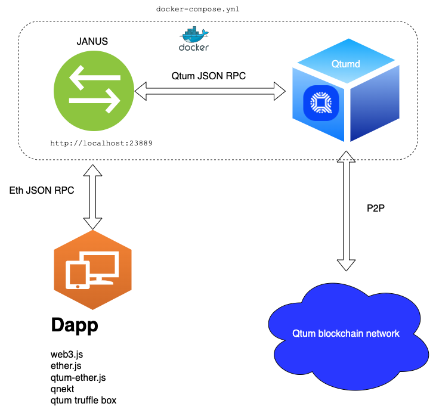

# Web3 Compatibility Layer

Janus is a web3 compatibility layer, it bridges the gap between Ethereum and Qtum.
It is not 100% compatible but with some caveats you can easily port an Ethereum app to Qtum.

[Introduction to Janus](https://blog.qtum.org/introduction-to-janus-795ca6b9b843)

[Janus on Github](https://github.com/qtumproject/janus)

