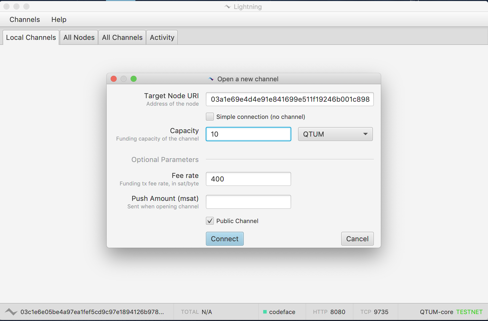

# How to run a Qtum Lightning network node

Qtum has now its own implementation of the lightning network, it uses the eclair client. Currently, this is only supported on testnet, let's check how to set it up and run our very own lightning network client!. 

it is recommended to run **Debian 10 (buster)** as it has all the library versions we need

# Install Qtum Core

Let's go ahead and install Qtum on our Debian 10, the easy way is to use the Qtum Debian repository:

## Enable the Qtum repository

#### Installing dirmngr and apt-transport-https

These two packages are needed to enable the Qtum repository on Debian, let's install them:

`apt install -y apt-transport-https dirmngr`

### Adding repository to your APT sources.

`sudo su` - Sudo to root first

`echo "deb https://repo.qtum.info/apt/debian/ buster main" >> /etc/apt/sources.list.d/qtum.list`

## Add Qtum key

Before installing, we need to add the Qtum apt key

`sudo apt-key adv --keyserver keyserver.ubuntu.com --recv-keys BF5B197`

### Refreshing APT sources and installing Qtum

`sudo apt update && sudo apt install qtum`

Qtum should be installed now, let's continue

## Create Qtum configuration file

We need to create the .qtum folder manually, also, we will create the configuration file inside of that folder, here's how:

`mkdir ~/.qtum`

`nano ~./qtum/qtum.conf` 

This will create a text file using the **nano** editor, copy/paste the following inside that file:

server=1  

rpcuser=foo  

rpcpassword=bar  

txindex=1  

addresstype=bech32  

zmqpubrawblock=tcp://127.0.0.1:29000  

zmqpubrawtx=tcp://127.0.0.1:29000

# Install Qtum Eclair - Lightning client

Let's install some dependencies to prepare for the lightning client:

## **Install JDK and Maven**

Qtum Eclair is developed using the Scala language. To run Qtum Eclair, you must first install the JDK, and OpenJDK 11 or above is recommended.

> apt-get install default-jdk
> 
> apt install maven

## **Build Qtum Eclair**

Now that we have every dependency installed, it's time to build the Eclair lightning client for Qtum. Again, inside our terminal we type:

- `git clone https://github.com/qtumproject/lightning-demo.git`
- `cd lightning-demo`
- `mvn install -DskipTests`

You should see something like this, if there's no errors, we can proceed with creating the configuration file and launch Qtum Eclair now.

## **Run Qtum Eclair**

Create and edit the configuration file ~/.qtum-eclair/eclair.conf as follows:

eclair {  
 chain = "testnet" // "mainnet" for mainnet, "testnet" for testnet, "regtest" for regtest  
 server {  
 public-ips = []  
 binding-ip = "0.0.0.0"  
 port = 9735  
 }  
 api {  
 enabled = false  
 binding-ip = "127.0.0.1"  
 port = 8080  
 password = "qtum-eclair"  
 use-old-api = false  
 }

watcher-type = "bitcoind"  
 bitcoind {  
 host = "localhost"  
 rpcport = 13889  
 bitdir = ""  
 rpcuser = "foo"  
 rpcpassword = "bar"  
 zmqblock = "tcp://127.0.0.1:29000"  
 zmqtx = "tcp://127.0.0.1:29000"  
 }

default-feerates {  
 delay-blocks {  
 1 = 1200000  
 2 = 1000000  
 6 = 800000  
 12 = 600000  
 36 = 500000  
 72 = 410000  
 }  
 }  
 min-feerate = 400  
 smooth-feerate-window = 6 // 1 = no smoothing  
 node-alias = "qtum-eclair"  
 node-color = "49daaa"  
 global-features = ""  
 local-features = "8a"  
 override-features = []  
 channel-flags = 1  
 dust-limit-satoshis = 72800  
 max-htlc-value-in-flight-msat = 500000000000 // 5 QTUM  
 htlc-minimum-msat = 1  
 max-accepted-htlcs = 30  
 reserve-to-funding-ratio = 0.01  
 max-reserve-to-funding-ratio = 0.05  
 to-remote-delay-blocks = 3600  
 max-to-local-delay-blocks = 10080  
 mindepth-blocks = 3  
 expiry-delta-blocks = 720  
 fee-base-msat = 400000  
 fee-proportional-millionths = 100  
 max-feerate-mismatch = 1.56  
 update-fee_min-diff-ratio = 0.1  
 revocation-timeout = 20 seconds  
 ping-interval = 30 seconds  
 ping-timeout = 10 seconds  
 ping-disconnect = true  
 auto-reconnect = true  
 payment-handler = "local"  
 payment-request-expiry = 1 hour  
 min-funding-satoshis = 1000000 // 0.01 Qtum  
 max-payment-attempts = 5  
 autoprobe-count = 0

router {  
 randomize-route-selection = true  
 channel-exclude-duration = 60 seconds  
 broadcast-interval = 60 seconds  
 init-timeout = 5 minutes

path-finding {    

    max-route-length = 6
    max-cltv =  5040
    fee-threshold-sat = 8400
    max-fee-pct = 0.03
    heuristics-enable = true
    ratio-cltv = 0.15
    ratio-channel-age = 0.35
    ratio-channel-capacity = 0.5   } 

 }  
}

// do not edit or move this section  
eclair {  
 backup-mailbox {  
 mailbox-type = "akka.dispatch.BoundedMailbox"  
 mailbox-capacity = 1  
 mailbox-push-timeout-time = 0  
 }  
 backup-dispatcher {  
 executor = "thread-pool-executor"  
 type = PinnedDispatcher  
 }  
}

**PLEASE NOTE** if you modified the rpcuser and rpcpassword on qtum.conf, please modify this config file accordingly .

# Launch Qtum Eclair lightning client

Start the client with the command **java -jar ./eclair-node-gui/target/lightning-capsule.jar**

You should see the eclair desktop client as on the screenshot below:

# **Create a lightning network channel**

Right-click the lower left corner of the local Qtum Eclair client and select “Copy URI” to get its node address (public key).

Click the “Channel” button in the upper left corner and select “Open Channel”.

In the pop-up page, fill in the URI of the channel partner, and the capacity of the channel, which is set to 10 QTUM as an example, this will be the maximum capacity for this channel, this means, you can only transact up to 10 QTUM.

 Click “Connect” to create the channel. At this point, you need to wait for 6 blocks to confirm the transaction and the channel will be created successfully.

# **Lightning Network Payment**

Once the channel is set up, you can use the Lightning Network for micropayments.

Click the “Channel” button in the upper left corner, select “Receive Payment”, fill in the receipt amount in the pop-up page, click the “Generate” button to get your own receipt address. Here we choose a very small amount of 1 Satoshi, which is equivalent to 0.00000001 QTUM. Such a small transferred amount is unimaginable without using a lightning network.

Click the “Channel” button in the upper left corner, select “Send Payment”, fill in the other party’s lightning network receipt address and amount in the pop-up page, and click the “Send” button, then you can transfer tokens to the other party.

After the transfer is completed, the amount of the two parties’ changes instantaneously. Because this is a pure transaction off the chain, there is no need to wait for the block confirmation, and it is free of fees.

# **Close the channel for settlement**

The channel can be closed when the channel is no longer needed.

Click the “Close” button to close the channel.

Once closed, the remaining QTUM in the channel will be refunded to the respective Qtum Core wallet.
