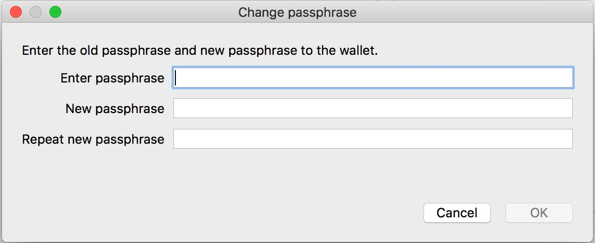

# 锁定、解锁Qtum钱包

如果您未运行Qtum节点，请先参考如下教程安装Qtum钱包：

* 命令行用户参考：《[如何部署 Qtum 量子链节点](../Guidance-of-Qtum-Deployment-and-RPC-Settings.md)》
* 图形界面钱包请从这里下载：[https://eco.qtum.org/wallet](https://eco.qtum.org/wallet)，其使用方法请参考《[Qtum PC 端钱包使用教程](../Qtum-Wallet-Tutorial.md)
》

**加密钱包或更改密码后，请务必重新备份您的钱包！**

请在安装并运行钱包后，再进行以下步骤：

## 锁定钱包

### 命令行用户

锁定钱包的命令为：

```
./qtum-cli encryptwallet "yourpassword"
```

其中`yourpassword`为用户自定义的密码。请用户务必牢记密码！

锁定后所有资金安全相关操作（如发送QTUM，dump私钥等）都需要先解锁钱包才能执行。

### 带用户界面钱包

菜单栏中选择`Setting-Encrypt Wallet`


输入密码并确认。设置成功后钱包会重新启动。


钱包重启后，会在右下角显示锁定标志，表示钱包已加锁：


## 解锁钱包

### 命令行用户

解锁钱包的命令为：

```
./qtum-cli walletpassphrase "yourpassword" 99999
```

其中第一个参数`yourpassword`为之前设定的密码；第二个参数为需要解锁的时间，单位是秒。

解锁后即可正常发送QTUM或进行其他资金安全相关操作。

如果只想解锁Staking（挖矿）功能，可以用一下命令：

```
./qtum-cli walletpassphrase "yourpassword" 99999 true
```

其中前两个参数含义不变，最后一个参数`true`表示只解锁挖矿功能，用该命令解锁后，钱包可以正常挖矿，但其他资金安全相关操作仍被禁止，只有完全解锁后才能使用。

### 带用户界面钱包

选择“Settings-unlock wallet”解锁钱包：


输入密码，解锁钱包。其中`For staking only`选框，若勾选，表示只解锁staking（挖矿），即可正常挖矿，但如需发送QTUM仍需输入密码。如果不勾选，则表示完全解锁。


解锁后钱包界面右下角的锁标志变为打开状态。

## 修改密码

### 命令行用户

修改密码的命令为：

```
./qtum-cli walletpassphrasechange "oldpassphrase" "newpassphrase"
```

第一个参数`oldpassphrase`表示原来的密码，第二个参数`newpassphrase`为新密码。

### 带用户界面钱包

选择“Setting-Change Passphrase”修改密码：


输入老密码和新密码，完成修改：


