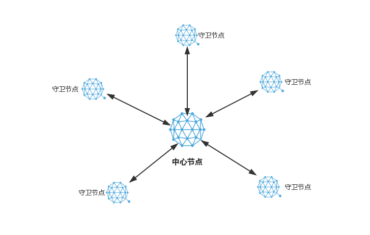

# 搭建 Qtum 星形网络

## 目的

Qtum 在 stake 时，要求节点必须在线，但是如果直接暴露在网络中，可能会有安全隐患，比如节点被入侵、服务器有漏洞或者 stake 节点被攻击导致不能正常 stake 等问题。通过搭建星形网络，可以让 stake 节点在网络上隐身，避免被攻击。中心节点负责 stake ，一旦产生新的区块，通过守卫节点来广播到网络中。守卫节点则暴露在网络中，所有来自网络的安全问题，都会被守卫节点拦下。当被攻击时，只要还有一个守卫节点在线，就能保证 stake 继续进行。

简而言之，星形网络实现了一个节点，他既能与外部区块链通信，同时自身处于一个相对封闭的网络以规避各种来自网络上的攻击和风险。




## 配置方法

### 1. 守卫节点

守卫节点无需特殊设置，它只需要正常启动且能被中心节点连接上即可。如果你处在一个有防火墙的环境，需要开放端口 3888.

### 2. 中心节点

Qtum 的启动参数有一个 `connect` 选项，官方说明如下：

```
  -connect=<ip>
       Connect only to the specified node; -noconnect disables automatic
       connections (the rules for this peer are the same as for
       -addnode). This option can be specified multiple times to connect
       to multiple nodes.
```

即可以指定某个 IP 地址，让节点只连接指定的 IP。 通过修改 Qtum 的配置文件，在配置文件里添加 `connect` 选项，即可让中心节点在启动的时候只连接指定节点。该选项可以添加多个，一行对应一个守卫节点。添加完毕后启动中心节点，可以看到它只连接了指定节点。


```conf
connect=192.168.76.32
connect=192.168.76.64
connect=192.168.76.111
connect=192.168.77.147
```


Linux 系统下可以通过 `qtum-cli getpeerinfo` 查看（此处为方便查看及截图，略去了无关信息）。


关于如何添加选项，可以参考这个文章：<https://docs.qtum.site/zh/How-To-Add-Options/>
