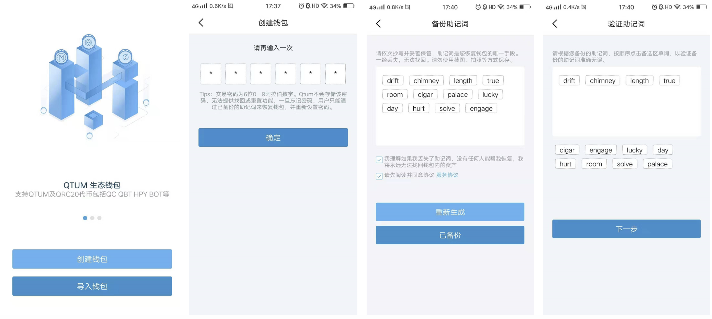
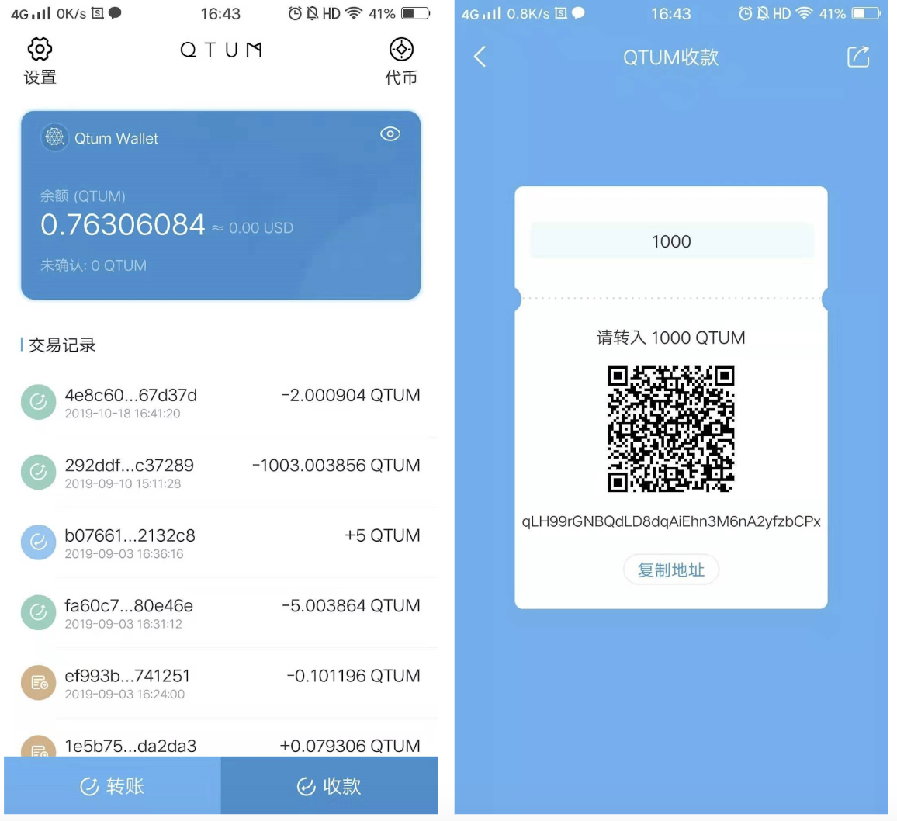
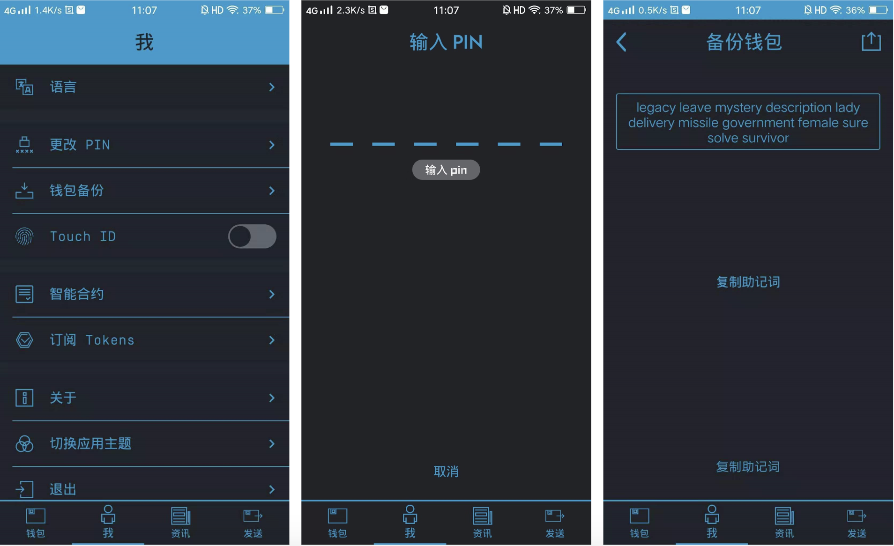

#Qtum 安卓钱包使用教程
##1. 生成新钱包
首次使用或重新创建新的Qtum钱包，你可以点击APP载入页中的"创建钱包"。首先，需要你连续输入两次相同的密码来设置密码，这个密码将会作为后续使用钱包的登陆和交易密码；然后，系统会随机生成12个助记词，这些助记词将会作为你账户的恢复密钥，需要用户将这些助记词保存好，且不被他人窃取；在备份好这些助记词后，用户需要依次输入这些助记词进行验证，当验证完成后，你的新钱包就生成了。

##2. 恢复钱包/导入钱包
当忘记Qtum安卓钱包的交易密码时，可以通过恢复钱包，重新设置新的交易密码；或者当你换手机或者换钱包应用时，需要导入原有的钱包，可以通过点击APP载入页中的"导入钱包"，目前提供两种方法导入：1是导入助记词；2是导入私钥。如果是你是导入Web钱包的助记词，则还需要输入原来的交易密码。导入成功后，输入两次密码即完成钱包创建。

##3. 如何转账

Qtum的转账入口非常地显眼，你可以通过点击首页左下角的"转账"按钮进入转账页面。目前有三种方式输入转账接收方的地址：1是通过复制或者手动输入地址；2是扫描接收方的二维码，钱包自动识别对方的地址；3是通过从钱包的地址簿中，而地址簿可以在"首页-设置"中进行添加。发送金额及备注输入完成后，点击下一步将会出现确认信息，代验证交易信息后再次点击下一步，即可通过输入密码发起交易。

##4. 如何收款
Qtum钱包支持二维码收款，通过首页的右下角的收款按键，你可以进入二维码设置界面，通过输入收款金额，自动生成收款特定QTUM的二维码，可以将此二维码分享给其他人。当然Qtum也支持传统的收款方式，通过复制你的钱包地址给需要付款的用户，让付款用户向你的钱包地址转账。

##5. 代币相关
Qtum钱包中支持的代币可以通过首页中右上角的图标进入查看，你可以看到钱包中默认添加的QC、QBT等，你可以通过代币页面中右上角的加号图标添加其他代币，比如BOT、INK等。如果在添加资产中没有找到你要添加的代币，可以通过搜索合约地址，来添加代币。在代币页面，点击具体代币可以进入该代币的资产交易页面，可以看到这个代币过去的交易记录。

##6. 旧版本钱包备份
在旧版本钱包中选择“我”进入设置页面，选择其中的“钱包备份”功能，通过输交易密码即可看到你的钱包对应的助记词，记录下助记词后，再在新版本的钱包中进行恢复。具体的恢复钱包过程，参考使用文档的第二部分“恢复钱包/导入钱包。

