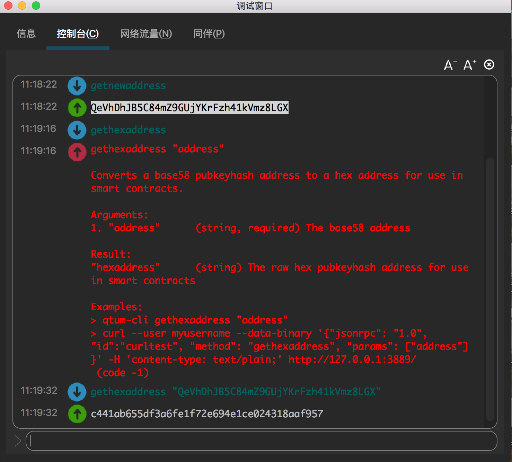
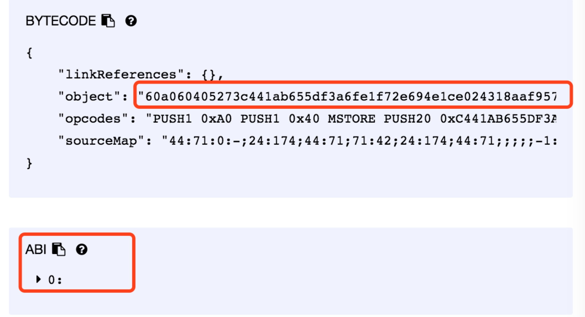
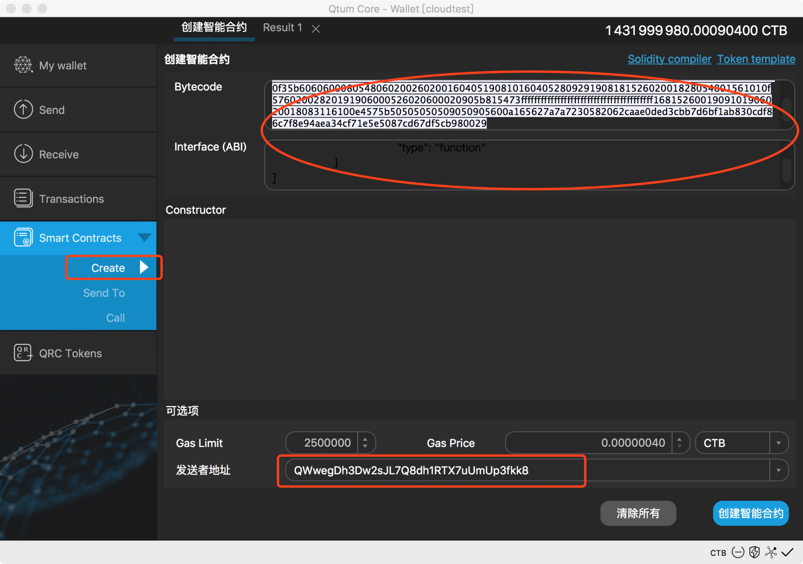
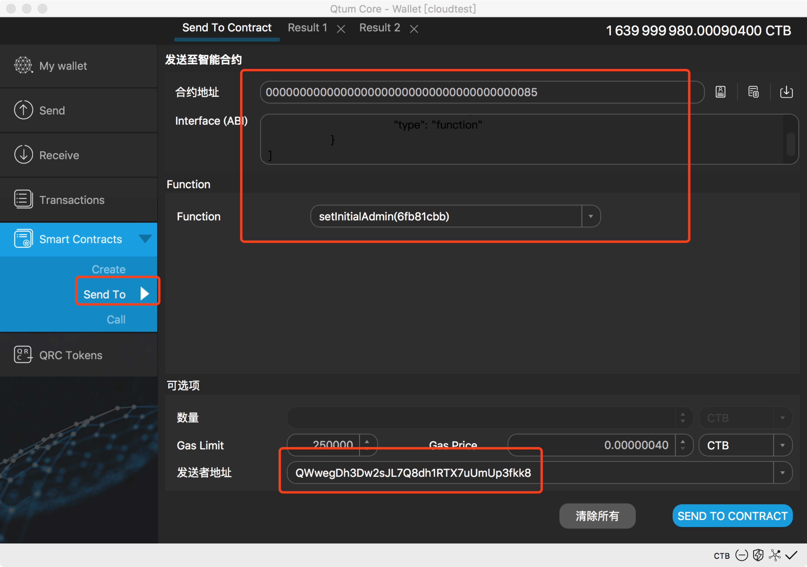
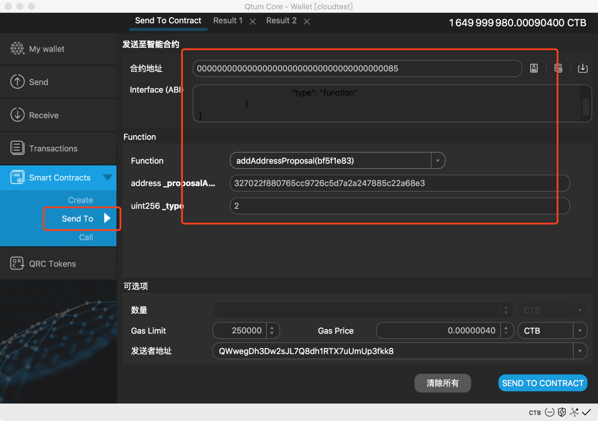
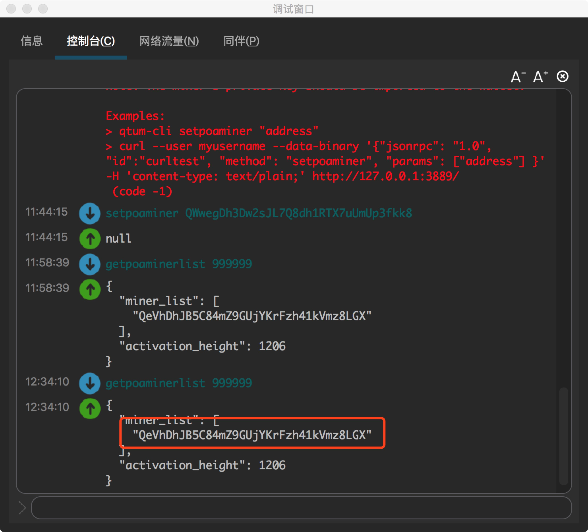

# QtumX一键发链教程

- [下载](#下载)
- [注册登录](#注册登录)
- [搭建私链](#搭建私链)
    - [生成配置](#生成配置)
    - [启动私链](#启动私链)
    - [连接私链](#连接私链)
- [种子节点](#种子节点)
- [搭建联盟链](#搭建联盟链)
    - [配置](#配置)
    - [启动](#启动)
- [线上治理](#线上治理)
    - [关于DGP](#关于dgp)
    - [修改矿工列表](#修改矿工列表)
    - [修改系统参数](#修改系统参数)

# 下载
从[Github](https://github.com/qtumproject/qtum-enterprise/releases)下载最新的安装包，安装至任意目录。

# 注册登录
1. 运行qtumd或者qtum-qt，启动Qtum主链。
2. 打开QT钱包的 Help - Debug window - Console 或是通过qtum-cli执行rpc命令。
3. 执行getnewaddress命令，生成一个新的地址作为账户，记录下来。
4. 执行dumpprivkey命令，获得新地址的私钥，记录下来。
5. 打开QtumX[主页](https://qtumx.net/)，点击LOGIN，进入登录页。
6. 执行signmessage命令，使用刚才生成的地址对登陆页中的message进行签名，将签名结果填进登陆页。
7. 点击LOGIN完成登录。


# 搭建私链
为了便于理解，我们先介绍如何建立自己的私链。

## 生成配置
点击LAUNCH A NEW CHAIN，进入发链页。填写好所有新链的信息后，点击SUBMIT发布新链。各字段的含义如下。
1. Chain id：链名，只支持小写字母和数字，唯一。例如mychain123。
2. Token name：币名，只支持大写字母和数字，唯一。例如BTC、QTX。
3. Description：链的描述，用来介绍该链，也用于生成创世区块。例如：my first blockchain。
4. Message Header：网络包头，用于在网络传输的时候区分不同的链。4字节长度，十六进制表示，即8个0-9a-f的字符，例如：1234fedc。
5. Algorithm：共识算法。目前仅支持PoA共识，后续会提供更多选择。想更多了解PoA共识，参考[QtumX技术白皮书](https://docs.qtum.org/zh/Technical-White-Paper-for-QtumX/)。
6. Miner list: PoA的矿工列表，一个或多个address，逗号分隔。我们第一步建立私链，则使用默认填入的账户地址。
7. Block interval、Timeout：见技术白皮书，可直接使用默认值。
8. Default port：默认的端口地址。
9. Dns seed、Ip seed：新的节点在加入的时候，默认连接的网络中的种子节点。由于是私链，此处留空。
10. Init Reward：初始每个块的奖励。
11. Halving interval：奖励在多少个块后折半。
12. Halving times：最多折半几次。

## 启动私链
我们生成了一个名为x的链（[链接](https://qtumx.net/#/chain/view?chainId=x)），按以下步骤启动该链。
1. 使用 qtumd -chain=x 或是 在qtum-qt中如下图配置重启后，启动名为x的链。

1. 执行getpoaminerlist，查看矿工列表。
2. 执行importprivkey命令，导入矿工的私钥。
3. 执行setpoaminer命令，开始使用矿工账户挖矿。每次节点重启后需要运行该命令开启挖矿。

5. 可以从QT钱包或是执行getblockchaininfo命令，看到block数在不断增加。

6. 新链启动成功，试着发交易或是智能合约吧！

## 连接私链
假设我们已经在机器A上启动了私链x并进行挖矿，这时我们需要在机器B上启动节点并接入该私链。
1. 在机器B上使用 qtumd -chain=x 或是 在qtum-qt配置后启动链x的节点。
2. 运行 addnode "ip_A" add 命令，连接机器A上的节点。
3. 连接之后，可以通过getpeerinfo命令查看节点情况。
4. 试着在两个节点之间互发交易吧！


# 种子节点
区块链新节点在启动的时候可以通过连接种子节点（seed）快速地找到网络，省去了上文中addnode的步骤。种子节点可以是一个ip或是一个域名，对应的服务器上保持有节点运行。以下讲解配置种子节点的流程。
1. 新建一条名为xx的链（[链接](https://qtumx.net/#/chain/view?chainId=xx)），Dns seed中填写自己的域名，或是Ip seed中填写一台自己的服务器地址。如果使用域名的话，请将域名解析到自己的服务器上。
```
Dns seed:  beta.qtumx.net
Ip seed:  116.62.70.220
```
2. 登录服务器（116.62.70.220），使用 ./qtumd -chain=xx 的方式启动节点
```
root@116.62.70.220:./qtumd -chain=xx -daemon
```
3. 配置完成，这时候使用任何机器启动xx链，都会连接到种子节点获取数据。可以通过getpeerinfo看到连接上的节点。


# 搭建联盟链
联盟链与私链的不同之处在于，联盟链是由多位矿工共同维护的。EOS就是一个典型的联盟链：先通过竞选得到多个超级节点，然后由这些超级节点负责生产区块，并获得区块奖励。

## 配置
新建一个名为qtumx的联盟链（[链接](https://qtumx.net/#/chain/view?chainId=qtumx)）。相比私链，其主要的改动是miner list字段设置了3个矿工地址，地址之间以逗号分隔。
```
Miner list
QT65fYRCwq5tctNsVNVPNnHkwajArLFjo1,QjoHqQw5DsTniaqefuzbpuBDWW3C3qimy2,QWWdLoiHnFSNCjibCyGwbQjwtSzK5Unef3
```

## 启动
在种子服务器上依次启动3个节点，并且通过importprivkey和setpoaminer开启3个节点的挖矿。用getblockchaininfo可以看到区块链高度开始不断增长，系统正常运行。用getblock命令可以查看每个block的矿工。


# 线上治理
## 关于DGP
DGP(Decentralized Governance Protocol)是Qtum中应用的一项技术。它允许使用区块链上的智能合约去在线修改区块链的参数，这样就不会造成软分叉或是硬分叉。

DGP工作的方式非常直接了当。首先，由DGP的一名管理员发起提议去改变某一个系统参数。随后，所有的DGP管理员可以对这个提议进行投票。如果提议收到了足够多的赞同票，则该提议中的参数修改生效。然后，提议的内容会被存储在区块链上，方便区块链的软件去获取。

很明显，DGP非常适合用来存储和更新PoA中的授权矿工列表。授权的矿工可以看做是一个公钥的列表，这个列表可以通过配置文件初始化，然后再通过DGP进行更新。但这里我们需要对DGP做一些修改从而让矿工的更新过程更加安全。

由DGP更新的矿工列表需要至少延迟n/2+1个块之后真正生效。

这里，n是更新前列表的长度，n/2是整数除法。这一机制保证了矿工列表的更新操作会在其成为区块链上的永久记录之后才真正生效。否则，如果更新操作可以被另一个分叉否定掉，则列表更新前的矿工很有可能在这个分叉下继续挖矿甚至产生硬分叉。
## 修改矿工列表
矿工列表的DGP部署在了地址"0000000000000000000000000000000000000085"上，其源码在Github上可以找到:[gp-template.sol.js](https://github.com/qtumproject/qtum-dgp/blob/master/dgp-template.sol.js)。矿工列表的存储合约 minerList-dgp.sol 如下：
```
pragma solidity ^0.4.8;
contract minerList{
address[] _minerList=[

	0x47210a1bacc15175bb24c3384e5d3650991a7bc4,

	0xfe6e43ffb52ef746a0db8cc51cb95921c34ca0a3,

	0x6cadd7aefdb363ae680fc234dcfe4c40919781d3

];

function getMinerList() constant returns(address[] vals){
	return _minerList;

}
}
```
更新矿工的过程可以简述如下：
1. 确定每位矿工的address，然后用gethexaddress命令得到对应的hexaddress。

2. 将所有矿工的hexaddress填入minerList-dgp.sol中的minerList参数中，得到新的矿工列表。

3. 编译生成minerList-dgp.sol的二进制代码，复制二进制代码，将二进制代码填入Qtum钱包中的下图位置。


4. 得到部署后的合约地址minerListAddress，然后调用dgp-template.sol中的setInitialAdmin()和addAddressProposal(minerListAddress, 2)函数，对新的minerListAddress进行投票。


5. 收到足够多的投票后，新的minerListAddress通过，记入进paramsHistory参数中，延迟若干个block（当前为500）后生效,执行getpoaminerlist显示如下。


## 修改系统参数
首先通过listcontracts命令查看目前链上有哪些合约。

其中，80-85为DGP合约，分别用于 gas_schedule、block_size、gas_price、预留、block_gas_limit、miner_list 参数的在线管理。具体方法可以参照上节更新矿工的方法。

注意：在修改参数前，务必先调用DGP合约中的setInitialAdmin()函数

可以使用createcontract命令创建新的合约，callcontract去调用合约中的函数查看返回结果，sendtocontract去向合约发送token和数据。更多合约操作请查看：[Qtum智能合约使用方法及说明](http://docs.qtum.site/zh/Qtum-Contract-Usage.html)。
