### 概览 (Overview)

这是 Qtum 量子链钱包的“**概览**”界面，也是启动之后的默认界面，可以看到下面这些信息：

1. 余额

- 可使用的余额
- 等待中的余额
- 总额
- 其他代币

2. 最近交易记录

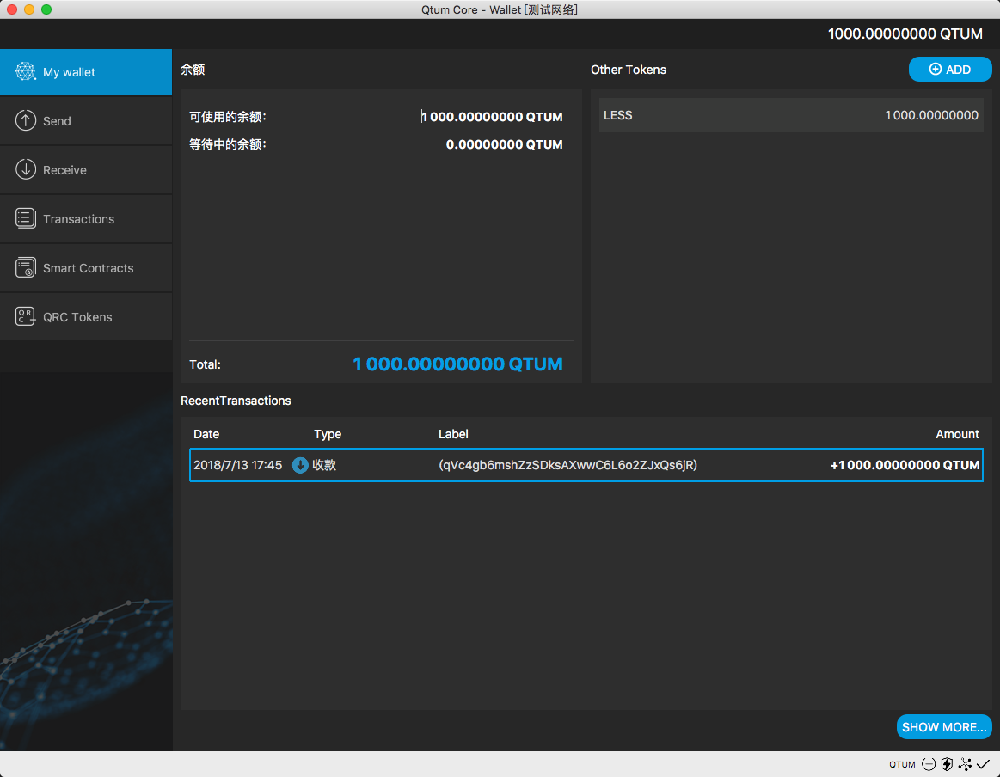


### 发送 (Send)

在发送界面中，可以向 Qtum 地址发送 Qtum 。


**付给：** 在此处输入想要发送的Qtum接收地址，**请注意只有Qtum地址有效**。
**标签：** 可选项，给上面输入的地址打标签。
**金额：** 在此处输入要发送的Qtum数额。

填写完各项后，点击发送，等待3秒后再次确认，即可将 Qtum 发送至目标地址。你也可以点击下方的添加收款人同时发送到多个地址。


#### 找零地址

默认的找零地址是随机生成的新地址，可以通过偏好设置来管理找零地址。在偏好设置->钱包界面，勾选 "Don't use change address" 将使用发送地址作为找零地址，勾选“启用货币控制功能“可以在发送时指定找零地址。

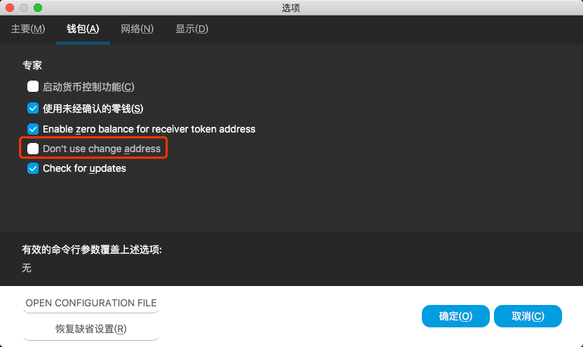

### 接收 (Receive)

在这里可以生成 Qtum 接收地址，并看到过往的接收地址。

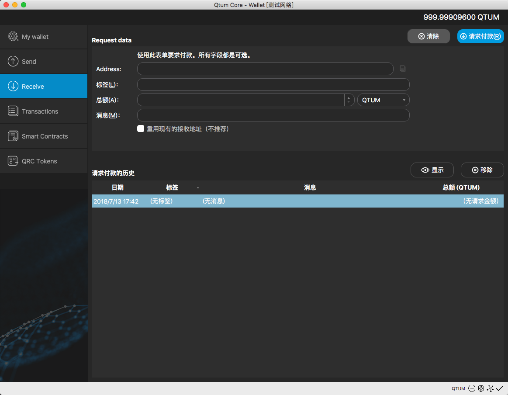

点击“请求付款”可以生成一个新的 Qtum 地址，同时也可以指定金额和备注。下图示例中填写了10个 Qtum 作为付款金额。

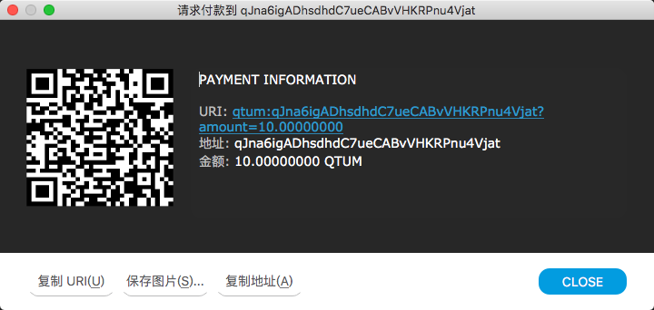


### 智能合约 (Smart Contract)

智能合约分为创建、发送和调用三个部分，下面以一个 QRC20 代币合约做说明。

合约代码如下使用[https://github.com/icodeface/QRC20Token](https://github.com/icodeface/QRC20Token)的 v2 版本，使用[Remix](https://remix.ethereum.org/)对合约代码进行编译，得到的 `Bytecode` 和 `ABI` 如下：

Bytecode （请注意他很长）

```
60806040526040805190810160405280600581526020017f416c70686100000000000000000000000000000000000000000000000000000081525060009080519060200190620000519291906200020a565b506040805190810160405280600581526020017f414c504841000000000000000000000000000000000000000000000000000000815250600190805190602001906200009f9291906200020a565b506008600260006101000a81548160ff021916908360ff1602179055506000600355348015620000ce57600080fd5b506040516200101a3803806200101a8339810180604052810190808051820192919060200180518201929190602001805190602001909291908051906020019092919050505083600090805190602001906200012c9291906200020a565b508260019080519060200190620001459291906200020a565b5081600260006101000a81548160ff021916908360ff16021790555080600381905550600354600460003373ffffffffffffffffffffffffffffffffffffffff1673ffffffffffffffffffffffffffffffffffffffff168152602001908152602001600020819055503373ffffffffffffffffffffffffffffffffffffffff1660007fddf252ad1be2c89b69c2b068fc378daa952ba7f163c4a11628f55a4df523b3ef6003546040518082815260200191505060405180910390a350505050620002b9565b828054600181600116156101000203166002900490600052602060002090601f016020900481019282601f106200024d57805160ff19168380011785556200027e565b828001600101855582156200027e579182015b828111156200027d57825182559160200191906001019062000260565b5b5090506200028d919062000291565b5090565b620002b691905b80821115620002b257600081600090555060010162000298565b5090565b90565b610d5180620002c96000396000f3006080604052600436106100a4576000357c0100000000000000000000000000000000000000000000000000000000900463ffffffff16806306fdde03146100a9578063095ea7b31461013957806318160ddd1461019e57806323b872dd146101c9578063313ce5671461024e5780635a3b7e421461027f57806370a082311461030f57806395d89b4114610366578063a9059cbb146103f6578063dd62ed3e1461045b575b600080fd5b3480156100b557600080fd5b506100be6104d2565b6040518080602001828103825283818151815260200191508051906020019080838360005b838110156100fe5780820151818401526020810190506100e3565b50505050905090810190601f16801561012b5780820380516001836020036101000a031916815260200191505b509250505060405180910390f35b34801561014557600080fd5b50610184600480360381019080803573ffffffffffffffffffffffffffffffffffffffff16906020019092919080359060200190929190505050610574565b604051808215151515815260200191505060405180910390f35b3480156101aa57600080fd5b506101b3610724565b6040518082815260200191505060405180910390f35b3480156101d557600080fd5b50610234600480360381019080803573ffffffffffffffffffffffffffffffffffffffff169060200190929190803573ffffffffffffffffffffffffffffffffffffffff1690602001909291908035906020019092919050505061072e565b604051808215151515815260200191505060405180910390f35b34801561025a57600080fd5b50610263610a0e565b604051808260ff1660ff16815260200191505060405180910390f35b34801561028b57600080fd5b50610294610a25565b6040518080602001828103825283818151815260200191508051906020019080838360005b838110156102d45780820151818401526020810190506102b9565b50505050905090810190601f1680156103015780820380516001836020036101000a031916815260200191505b509250505060405180910390f35b34801561031b57600080fd5b50610350600480360381019080803573ffffffffffffffffffffffffffffffffffffffff169060200190929190505050610a5e565b6040518082815260200191505060405180910390f35b34801561037257600080fd5b5061037b610a76565b6040518080602001828103825283818151815260200191508051906020019080838360005b838110156103bb5780820151818401526020810190506103a0565b50505050905090810190601f1680156103e85780820380516001836020036101000a031916815260200191505b509250505060405180910390f35b34801561040257600080fd5b50610441600480360381019080803573ffffffffffffffffffffffffffffffffffffffff16906020019092919080359060200190929190505050610b18565b604051808215151515815260200191505060405180910390f35b34801561046757600080fd5b506104bc600480360381019080803573ffffffffffffffffffffffffffffffffffffffff169060200190929190803573ffffffffffffffffffffffffffffffffffffffff169060200190929190505050610cc9565b6040518082815260200191505060405180910390f35b606060008054600181600116156101000203166002900480601f01602080910402602001604051908101604052809291908181526020018280546001816001161561010002031660029004801561056a5780601f1061053f5761010080835404028352916020019161056a565b820191906000526020600020905b81548152906001019060200180831161054d57829003601f168201915b5050505050905090565b60008260008173ffffffffffffffffffffffffffffffffffffffff161415151561059d57600080fd5b600083148061062857506000600560003373ffffffffffffffffffffffffffffffffffffffff1673ffffffffffffffffffffffffffffffffffffffff16815260200190815260200160002060008673ffffffffffffffffffffffffffffffffffffffff1673ffffffffffffffffffffffffffffffffffffffff16815260200190815260200160002054145b151561063357600080fd5b82600560003373ffffffffffffffffffffffffffffffffffffffff1673ffffffffffffffffffffffffffffffffffffffff16815260200190815260200160002060008673ffffffffffffffffffffffffffffffffffffffff1673ffffffffffffffffffffffffffffffffffffffff168152602001908152602001600020819055508373ffffffffffffffffffffffffffffffffffffffff163373ffffffffffffffffffffffffffffffffffffffff167f8c5be1e5ebec7d5bd14f71427d1e84f3dd0314c0f7b2291e5b200ac8c7c3b925856040518082815260200191505060405180910390a3600191505092915050565b6000600354905090565b60008360008173ffffffffffffffffffffffffffffffffffffffff161415151561075757600080fd5b8360008173ffffffffffffffffffffffffffffffffffffffff161415151561077e57600080fd5b610804600560008873ffffffffffffffffffffffffffffffffffffffff1673ffffffffffffffffffffffffffffffffffffffff16815260200190815260200160002060003373ffffffffffffffffffffffffffffffffffffffff1673ffffffffffffffffffffffffffffffffffffffff1681526020019081526020016000205485610cee565b600560008873ffffffffffffffffffffffffffffffffffffffff1673ffffffffffffffffffffffffffffffffffffffff16815260200190815260200160002060003373ffffffffffffffffffffffffffffffffffffffff1673ffffffffffffffffffffffffffffffffffffffff168152602001908152602001600020819055506108cd600460008873ffffffffffffffffffffffffffffffffffffffff1673ffffffffffffffffffffffffffffffffffffffff1681526020019081526020016000205485610cee565b600460008873ffffffffffffffffffffffffffffffffffffffff1673ffffffffffffffffffffffffffffffffffffffff16815260200190815260200160002081905550610959600460008773ffffffffffffffffffffffffffffffffffffffff1673ffffffffffffffffffffffffffffffffffffffff1681526020019081526020016000205485610d07565b600460008773ffffffffffffffffffffffffffffffffffffffff1673ffffffffffffffffffffffffffffffffffffffff168152602001908152602001600020819055508473ffffffffffffffffffffffffffffffffffffffff168673ffffffffffffffffffffffffffffffffffffffff167fddf252ad1be2c89b69c2b068fc378daa952ba7f163c4a11628f55a4df523b3ef866040518082815260200191505060405180910390a36001925050509392505050565b6000600260009054906101000a900460ff16905090565b6040805190810160405280600981526020017f546f6b656e20302e31000000000000000000000000000000000000000000000081525081565b60046020528060005260406000206000915090505481565b606060018054600181600116156101000203166002900480601f016020809104026020016040519081016040528092919081815260200182805460018160011615610100020316600290048015610b0e5780601f10610ae357610100808354040283529160200191610b0e565b820191906000526020600020905b815481529060010190602001808311610af157829003601f168201915b5050505050905090565b60008260008173ffffffffffffffffffffffffffffffffffffffff1614151515610b4157600080fd5b610b8a600460003373ffffffffffffffffffffffffffffffffffffffff1673ffffffffffffffffffffffffffffffffffffffff1681526020019081526020016000205484610cee565b600460003373ffffffffffffffffffffffffffffffffffffffff1673ffffffffffffffffffffffffffffffffffffffff16815260200190815260200160002081905550610c16600460008673ffffffffffffffffffffffffffffffffffffffff1673ffffffffffffffffffffffffffffffffffffffff1681526020019081526020016000205484610d07565b600460008673ffffffffffffffffffffffffffffffffffffffff1673ffffffffffffffffffffffffffffffffffffffff168152602001908152602001600020819055508373ffffffffffffffffffffffffffffffffffffffff163373ffffffffffffffffffffffffffffffffffffffff167fddf252ad1be2c89b69c2b068fc378daa952ba7f163c4a11628f55a4df523b3ef856040518082815260200191505060405180910390a3600191505092915050565b6005602052816000526040600020602052806000526040600020600091509150505481565b6000818310151515610cfc57fe5b818303905092915050565b6000808284019050838110151515610d1b57fe5b80915050929150505600a165627a7a723058200a1e9096aed2390ca8c214d802cecae0479f8f12c10148784f2bd5f226f8775d0029
```

ABI

```json
[
	{
		"constant": true,
		"inputs": [],
		"name": "name",
		"outputs": [
			{
				"name": "_name",
				"type": "string"
			}
		],
		"payable": false,
		"stateMutability": "view",
		"type": "function"
	},
	{
		"constant": false,
		"inputs": [
			{
				"name": "_spender",
				"type": "address"
			},
			{
				"name": "_value",
				"type": "uint256"
			}
		],
		"name": "approve",
		"outputs": [
			{
				"name": "success",
				"type": "bool"
			}
		],
		"payable": false,
		"stateMutability": "nonpayable",
		"type": "function"
	},
	{
		"constant": true,
		"inputs": [],
		"name": "totalSupply",
		"outputs": [
			{
				"name": "_totalSupply",
				"type": "uint256"
			}
		],
		"payable": false,
		"stateMutability": "view",
		"type": "function"
	},
	{
		"constant": false,
		"inputs": [
			{
				"name": "_from",
				"type": "address"
			},
			{
				"name": "_to",
				"type": "address"
			},
			{
				"name": "_value",
				"type": "uint256"
			}
		],
		"name": "transferFrom",
		"outputs": [
			{
				"name": "success",
				"type": "bool"
			}
		],
		"payable": false,
		"stateMutability": "nonpayable",
		"type": "function"
	},
	{
		"constant": true,
		"inputs": [],
		"name": "decimals",
		"outputs": [
			{
				"name": "_decimals",
				"type": "uint8"
			}
		],
		"payable": false,
		"stateMutability": "view",
		"type": "function"
	},
	{
		"constant": true,
		"inputs": [],
		"name": "standard",
		"outputs": [
			{
				"name": "",
				"type": "string"
			}
		],
		"payable": false,
		"stateMutability": "view",
		"type": "function"
	},
	{
		"constant": true,
		"inputs": [
			{
				"name": "",
				"type": "address"
			}
		],
		"name": "balanceOf",
		"outputs": [
			{
				"name": "",
				"type": "uint256"
			}
		],
		"payable": false,
		"stateMutability": "view",
		"type": "function"
	},
	{
		"constant": true,
		"inputs": [],
		"name": "symbol",
		"outputs": [
			{
				"name": "_symbol",
				"type": "string"
			}
		],
		"payable": false,
		"stateMutability": "view",
		"type": "function"
	},
	{
		"constant": false,
		"inputs": [
			{
				"name": "_to",
				"type": "address"
			},
			{
				"name": "_value",
				"type": "uint256"
			}
		],
		"name": "transfer",
		"outputs": [
			{
				"name": "success",
				"type": "bool"
			}
		],
		"payable": false,
		"stateMutability": "nonpayable",
		"type": "function"
	},
	{
		"constant": true,
		"inputs": [
			{
				"name": "",
				"type": "address"
			},
			{
				"name": "",
				"type": "address"
			}
		],
		"name": "allowance",
		"outputs": [
			{
				"name": "",
				"type": "uint256"
			}
		],
		"payable": false,
		"stateMutability": "view",
		"type": "function"
	},
	{
		"inputs": [
			{
				"name": "_name",
				"type": "string"
			},
			{
				"name": "_symbol",
				"type": "string"
			},
			{
				"name": "_decimals",
				"type": "uint8"
			},
			{
				"name": "_totalSupply",
				"type": "uint256"
			}
		],
		"payable": false,
		"stateMutability": "nonpayable",
		"type": "constructor"
	},
	{
		"payable": true,
		"stateMutability": "payable",
		"type": "fallback"
	},
	{
		"anonymous": false,
		"inputs": [
			{
				"indexed": true,
				"name": "_from",
				"type": "address"
			},
			{
				"indexed": true,
				"name": "_to",
				"type": "address"
			},
			{
				"indexed": false,
				"name": "_value",
				"type": "uint256"
			}
		],
		"name": "Transfer",
		"type": "event"
	},
	{
		"anonymous": false,
		"inputs": [
			{
				"indexed": true,
				"name": "_owner",
				"type": "address"
			},
			{
				"indexed": true,
				"name": "_spender",
				"type": "address"
			},
			{
				"indexed": false,
				"name": "_value",
				"type": "uint256"
			}
		],
		"name": "Approval",
		"type": "event"
	}
]
```

#### 创建合约 (Create)

将上面的 `Bytecode` 和 `ABI` 填入表里，钱包会自动识别出参数列表，填写好之后点击创建智能合约，若执行成功，则可以看到结果。

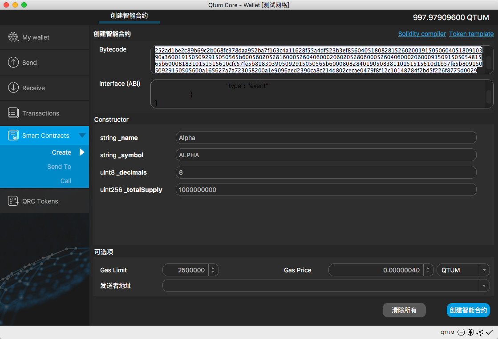


如上图得到你的合约地址是 `91191f443b6aa395ba24ab72430f00297e5d2121`。

#### 向合约发送数据 (Send To)

向合约发送数据需要填写合约地址和 ABI ，合约地址在上一个步骤得到， ABI 与之前的一致。填写好之后钱包会识别出来可以调用的方法，这里以 `transfer` 为例。注意 `Send To` 操作会消耗你的 Qtum。

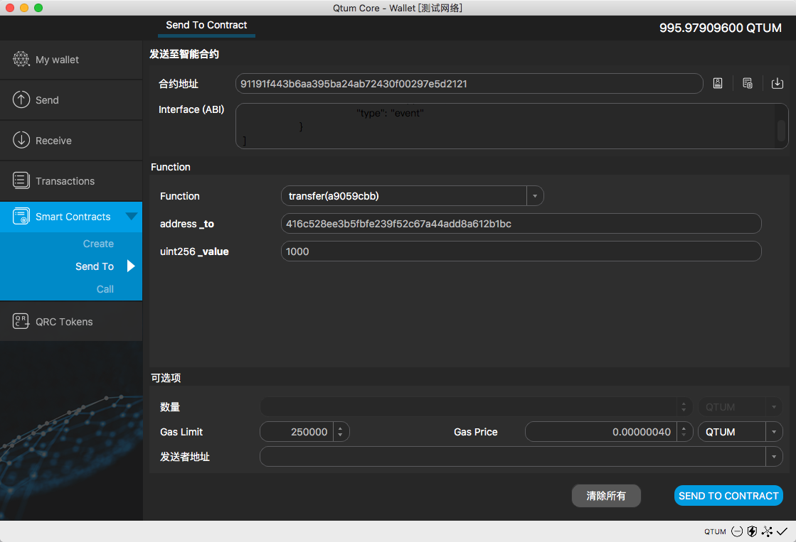


*注意*，这里的地址填写的是16进制格式地址，可以通过控制台的 `gethexaddress` 命令获取。

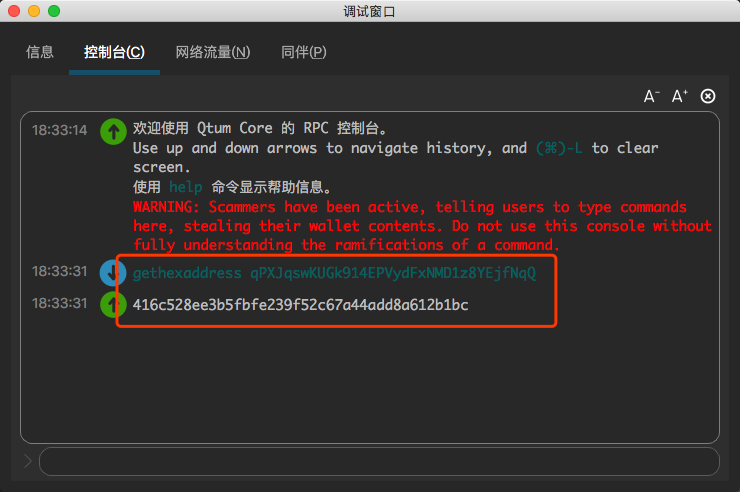

#### 本地调用 (Call)

和发送一样，填写好合约地址和 ABI ，钱包会识别出来可以本地调用的方法，本地调用无需消耗 Qtum。


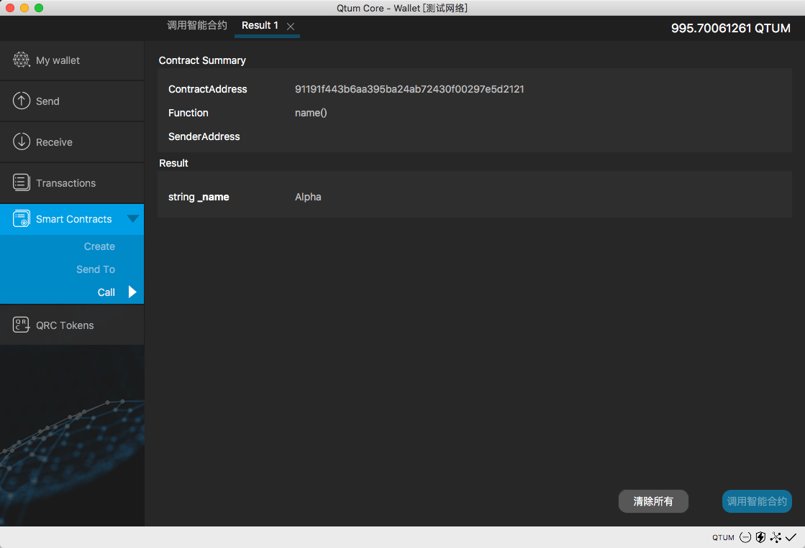


### 交易记录 (Transactions)

该页显示钱包所有地址的交易记录，包括收入、支出、发送代币、挖矿等。


### QRC 代币 (QRC Token)

在这里，可以发送、接收、添加 QR C代币，也可以通过开启 "log events" 查看QRC代币的交易记录。


#### 添加代币
点击 "Add Token" 可以添加一个新的 QRC 代币。
**Contract Address**: 代币合约地址。
**Token Name**: 代币名称，填写完合约地址后回自动识别出来。
**Token Symbol**:  代币符号，填写完合约地址后回自动识别出来。
**Decimals**: 小数位，填写完合约地址后回自动识别出来。
**Token Address**: 用于接收代币的 Qtum 地址，通过下拉选择一个地址。
填写完以上信息之后，点击 "Confirm" 即可添加一个QRC代币到你的钱包。同一个代币绑定同一个 Qtum 地址只能添加一次。


#### 发送代币
在左侧选择一个代币，点击 "Send" 进 入发送界面，与发送Qtum有些相似。
**PayTo**: 代币接收地址。
**Amount**: 代币数量，最大值为当前余额，注意少数代币最大发送数额必须小于当前余额，如INK。
**Description**:  本次交易备注，可选项。
**GasLimit**: 默认即可。
**GasPrice**: 默认即可。
填写完以上信息之后，点击 “Confirm" 即可发送QRC代币到指定地址。

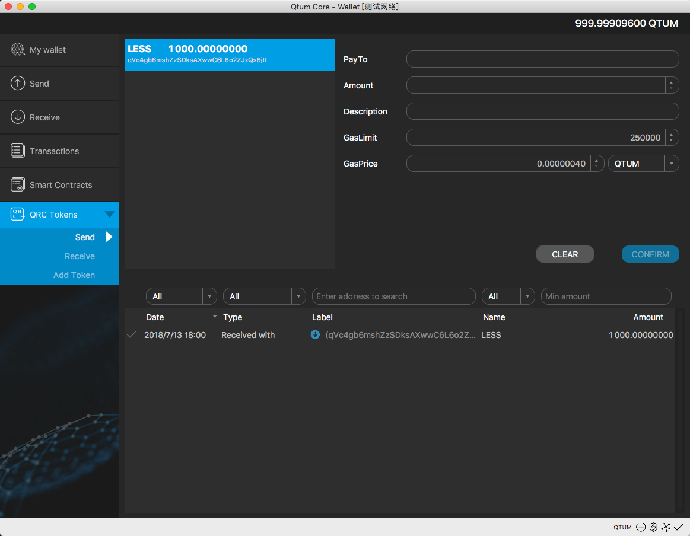

#### 接收代币
接收代币十分简单，选择一个代币，点击 "Receive" 右侧即出现接收地址，也可以右键点击，选择 "Copy receive address" 。


#### 开启 "log events"
在偏好设置->主要界面，勾选 "Enable log events" ，点击确认后钱包会重启并开启 "log events" ，此时即可查看 QRC 代币交易记录。

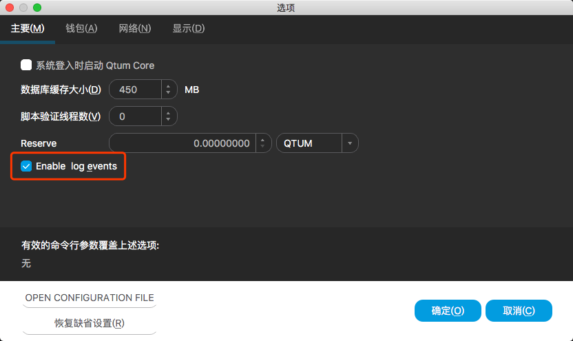


### 加密钱包

首先，在备份钱包之前加密你的钱包将使得你的备份也被加密。点击 "Settings -> Encrypt Wallet" 。

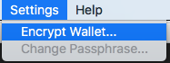

然后，然输入密码，**请务必保管好这个密码，否则你会丢掉你的Qtum**。


输入完两个密码并确认之后，钱包会自动重启，并变成加密模式。


### 备份钱包

强烈推荐**加密钱包之后**再备份钱包！

点击 "File -> Backup Wallet" 以备份钱包。


输入备份的文件名，选择好保存位置后点击保存，即可备份钱包。


### 从备份中恢复钱包

最新版本的 Qtum 钱包已经在界面上实现了备份管理。你可以轻松的备份、恢复你的钱包。
​

#### Mac系统

点击 "File ->  Restore Wallet" ，在弹出的对话框里选择要恢复的钱包备份文件。

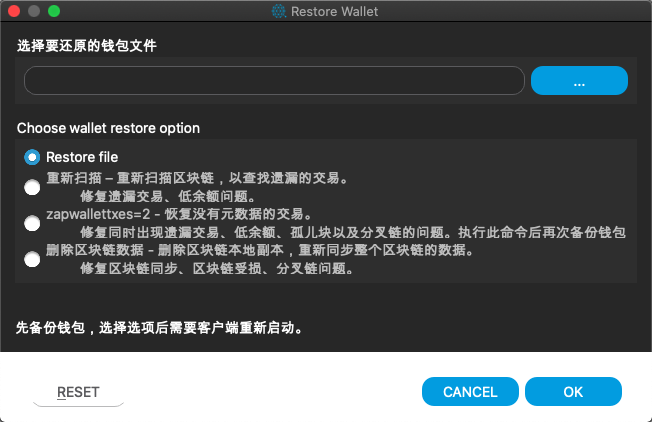


通常情况下选择```reindex```选项即可，除非你遇到特殊的情况。


#### Windows系统

和 Mac 系统下操作基本一样。


#### Linux系统

和 Mac 系统下操作基本一样。


### 挖矿

当你满足如下条件时就可以进行挖矿：

1. 钱包中有超过500个确认的 Qtum ；
2. 解锁钱包；
3. 保持钱包在线状态。

更多细节可以参考：[http://docs.qtum.site/zh/How-to-Staking-with-Qtum/](http://docs.qtum.site/zh/How-to-Staking-with-Qtum/)