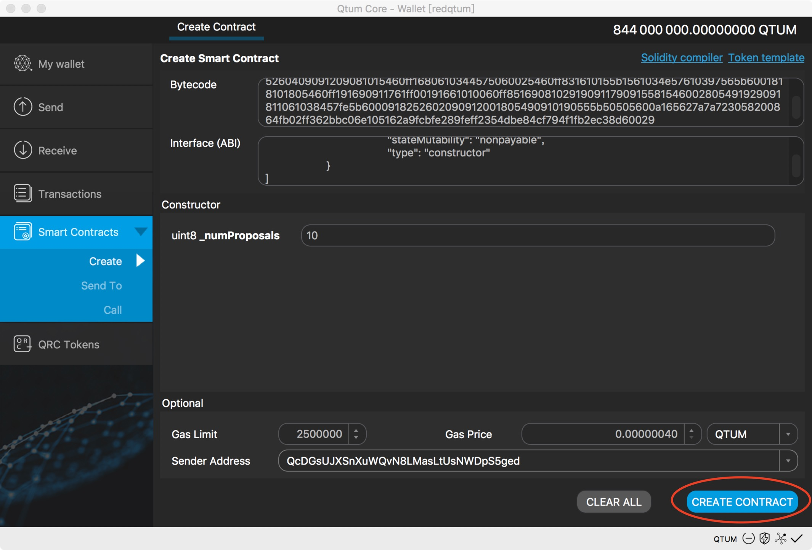
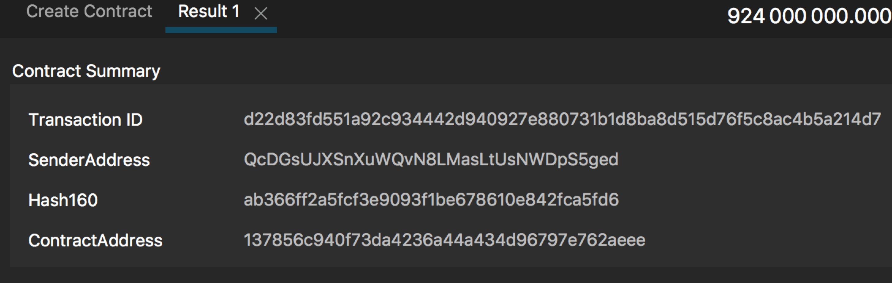

# 基于QtumX搭建自己的Dapp
---
- [背景](#背景)
- [前提条件](#前提条件)
- [智能合约的部署](#智能合约的部署)
- [与智能合约交互](#与智能合约交互)
- [注意事项](#注意事项)

# 背景
在QtumX上创建了自己的区块链之后，可以进行智能合约的开发和发布，从而提供基于区块链的应用。**由于搭建的区块链属于私链或联盟链，所以智能合约应用不需要消耗公链上的token，这样就大幅度节约了开发成本。**QtumX和Qtum一样，支持以太坊虚拟机EVM。因此，所有基于Solidity的智能合约代码都可直接运行在QtumX上。

# 前提条件
  安装QtumX，并发布自己的私有链，[私有链搭建教程](https://docs.qtum.org/zh/One-Click-Launch-Chain/)。该篇介绍在qtum-qt客户端下进行智能合约的部署和交互，建立在Qtum私有链基础上，需要一些简单命令行操作，demo选择了solidity的经典投票demo。
  

---

# 智能合约的部署
1. 启动qtum-qt进入私有链环境，在qtum-qt的Help - Debug window - Console中通过setpoaminer命令启动矿工挖矿（一定要启动挖矿否则无法产生新区块，智能合约无法被记录则无法部署到私有链上）。
2. 编写Solidity智能合约代码，可以选择在线IDE [Remix](https://http://remix.ethereum.org/)。关于solidity如何编写，在这里提供几个教程分享给大家学习：

	1. [Solidity官方文档](https://solidity.readthedocs.io/en/v0.4.24/index.html#)（可选中文翻译）

	2. [Solidity教程中文版](http://www.tryblockchain.org/)

	3. [Qtum智能合约使用方法及说明](https://docs.qtum.org/zh/Qtum-Contract-Usage.html)

3. 我们提供了投票Ballot的demo，源码如下：
```
pragma solidity ^0.4.0;
contract Ballot {

    struct Voter {
        uint weight;
        bool voted;
        uint8 vote;
        address delegate;
    }
    struct Proposal {
        uint voteCount;
    }

    address chairperson;
    mapping(address => Voter) voters;
    Proposal[] proposals;

    /// Create a new ballot with $(_numProposals) different proposals.
    function Ballot(uint8 _numProposals) public {
        chairperson = msg.sender;
        voters[chairperson].weight = 1;
        proposals.length = _numProposals;
    }

    /// Give $(toVoter) the right to vote on this ballot.
    /// May only be called by $(chairperson).
    function giveRightToVote(address toVoter) public {
        if (msg.sender != chairperson || voters[toVoter].voted) return;
        voters[toVoter].weight = 1;
    }

    /// Delegate your vote to the voter $(to).
    function delegate(address to) public {
        Voter storage sender = voters[msg.sender]; // assigns reference
        if (sender.voted) return;
        while (voters[to].delegate != address(0) && voters[to].delegate != msg.sender)
            to = voters[to].delegate;
        if (to == msg.sender) return;
        sender.voted = true;
        sender.delegate = to;
        Voter storage delegateTo = voters[to];
        if (delegateTo.voted)
            proposals[delegateTo.vote].voteCount += sender.weight;
        else
            delegateTo.weight += sender.weight;
    }

    /// Give a single vote to proposal $(toProposal).
    function vote(uint8 toProposal) public {
        Voter storage sender = voters[msg.sender];
        if (sender.voted || toProposal >= proposals.length) return;
        sender.voted = true;
        sender.vote = toProposal;
        proposals[toProposal].voteCount += sender.weight;
    }

    function winningProposal() public constant returns (uint8 _winningProposal) {
        uint256 winningVoteCount = 0;
        for (uint8 prop = 0; prop < proposals.length; prop++)
            if (proposals[prop].voteCount > winningVoteCount) {
                winningVoteCount = proposals[prop].voteCount;
                _winningProposal = prop;
            }
    }
}
```
4. 将源码转化为在qtum-qt中需要的bytecode和ABI，在Remix的右侧边栏找到Compile进行编译，编译无误后点击Details（bytecode中选择“object”项进行复制，只需要输入该项）查看并复制。以下是编译后的bytecode和ABI：
	1. bytecode：
```
608060405234801561001057600080fd5b50604051602080610487833981016040908152905160008054600160a060020a0319163317808255600160a060020a03168152600160208190529290209190915560ff8116610060600282610067565b50506100b1565b81548183558181111561008b5760008381526020902061008b918101908301610090565b505050565b6100ae91905b808211156100aa5760008155600101610096565b5090565b90565b6103c7806100c06000396000f3006080604052600436106100615763ffffffff7c01000000000000000000000000000000000000000000000000000000006000350416635c19a95c8114610066578063609ff1bd146100895780639e7b8d61146100b4578063b3f98adc146100d5575b600080fd5b34801561007257600080fd5b50610087600160a060020a03600435166100f0565b005b34801561009557600080fd5b5061009e610250565b6040805160ff9092168252519081900360200190f35b3480156100c057600080fd5b50610087600160a060020a03600435166102bb565b3480156100e157600080fd5b5061008760ff6004351661031b565b33600090815260016020819052604082209081015490919060ff16156101155761024b565b5b600160a060020a0383811660009081526001602081905260409091200154620100009004161580159061016d5750600160a060020a0383811660009081526001602081905260409091200154620100009004163314155b1561019f57600160a060020a039283166000908152600160208190526040909120015462010000900490921691610116565b600160a060020a0383163314156101b55761024b565b506001818101805460ff1916821775ffffffffffffffffffffffffffffffffffffffff0000191662010000600160a060020a0386169081029190911790915560009081526020829052604090209081015460ff16156102435781546001820154600280549091610100900460ff1690811061022c57fe5b60009182526020909120018054909101905561024b565b815481540181555b505050565b600080805b60025460ff821610156102b6578160028260ff1681548110151561027557fe5b906000526020600020016000015411156102ae576002805460ff831690811061029a57fe5b906000526020600020016000015491508092505b600101610255565b505090565b600054600160a060020a0316331415806102f15750600160a060020a0381166000908152600160208190526040909120015460ff165b156102fb57610318565b600160a060020a0381166000908152600160208190526040909120555b50565b3360009081526001602081905260409091209081015460ff1680610344575060025460ff831610155b1561034e57610397565b6001818101805460ff191690911761ff00191661010060ff85169081029190911790915581546002805491929091811061038457fe5b6000918252602090912001805490910190555b50505600a165627a7a723058200864fb02ff362bbc06e105162a9fcbfe289feff2354dbe84cf794f1fb2ec38d60029
```
	2. ABI：
```
[
	{
		"constant": false,
		"inputs": [
			{
				"name": "to",
				"type": "address"
			}
		],
		"name": "delegate",
		"outputs": [],
		"payable": false,
		"stateMutability": "nonpayable",
		"type": "function"
	},
	{
		"constant": true,
		"inputs": [],
		"name": "winningProposal",
		"outputs": [
			{
				"name": "_winningProposal",
				"type": "uint8"
			}
		],
		"payable": false,
		"stateMutability": "view",
		"type": "function"
	},
	{
		"constant": false,
		"inputs": [
			{
				"name": "toVoter",
				"type": "address"
			}
		],
		"name": "giveRightToVote",
		"outputs": [],
		"payable": false,
		"stateMutability": "nonpayable",
		"type": "function"
	},
	{
		"constant": false,
		"inputs": [
			{
				"name": "toProposal",
				"type": "uint8"
			}
		],
		"name": "vote",
		"outputs": [],
		"payable": false,
		"stateMutability": "nonpayable",
		"type": "function"
	},
	{
		"inputs": [
			{
				"name": "_numProposals",
				"type": "uint8"
			}
		],
		"payable": false,
		"stateMutability": "nonpayable",
		"type": "constructor"
	}
]
```
5. 将智能合约通过qtum-qt部署到私有链上。在图形界面选择Smart Contracts - Create，将bytecode和ABI粘贴到对应位置；demo需要初始化uint8类型的_numProposal，在部署智能合约时要填写；初始化参数后我们点击右下角的CREATE CONTRACT按钮，部署成功后会返回Result，可在其中看到交易ID、部署者地址SenderAddress和合约的部署地址（用于与智能合约交互）ContractAddress。



6. 部署完成后可以在交易列表Transactions中查看到对应的区块信息写入，且会耗费Gas。


---

# 与智能合约交互
1. 完成智能合约的部署后，我们可以在Smart Contracts下的Send To和Call与智能合约进行交互。由于私有链环境中暂时没有新节点和用户，我们可以切换到主链，在Debug Window中通过getnewaddress命令生成几个新的地址来进行模拟，后期可以加入真实的用户地址（注意：生成的地址不是合约需要传入的十六进制，可在Debug Window中通过gethexaddress $address获得地址的十六进制，且传入时不需要加0x前缀）。
2. 在Call Contract中可以调用智能合约中有返回的函数所返回的相关参数，输入合约地址和与想要查看的参数对应的ABI即可查看，Call操作所有计算在链下进行，不会消耗Gas。demo中可供查看的是投票胜出结果winningProposal，我们尚未进行任何数据写入，投票胜出结果返回默认值0。（Function中的（00）用于给智能合约传递Value，Qtum网络中即qtum，在Call Contract时可忽略）


3. 在Send To中的对应位置粘贴入合约地址和ABI，可调用智能合约的函数，send to会向智能合约中传递参数并写入数据，计算和存储在链上进行，所以会消耗Gas。这时的（00）可以实现向智能合约传递qtum，你也可以在智能合约中编写销毁地址，在智能合约被所有者声明销毁后这些qtum会返回进该账户。


4. 几个函数我们做一个简单介绍：
	1. giveRightToVote函数只能由chairman来调用，实现投票权利的下发，chairman即部署智能合约的地址，获得投票权的地址的weight +1；

	2. delegate函数由具有投票权的地址调用，可将自己的投票权委托给指定地址并记录如delegate变量，若被委托的地址的投票权也已委托给其他地址，则现在的投票权都集中于最终的被委托人；

	3. vote函数即向某一个地址投票（做了地址映射，可用编号代替，传入的是Proposal编号），由具有投票权的地址调用，投票后将自己的投票权重weight -1，被投票的Proposal 的voteCount +1；

	4. winningProposal遍历候选人proposal数组，将voteCount最大的proposal的数组下标（编号）返回，实现查看投票胜者。

---

# 注意事项
- 在智能合约的部署和交互过程中一定不要忘记设置挖矿节点。
- 在Remix中要选择匹配的solidity版本进行编译，避免版本不兼容造成编译错误。
- 智能合约部署后需要等待确认才能进行交互，你可以在Debug Window中输入getaccountinfo $CONTRACT或者直接在交易（Transaction）列表中查看智能合约信息。
- 在主链中生成新地址，在与智能合约交互时要转换成十六进制，不加0x前缀。
- 部署智能合约和send to需要消耗gas，如果是测试可以先给需要操作的地址进行转账，预留适当的qtum作为Gas。
