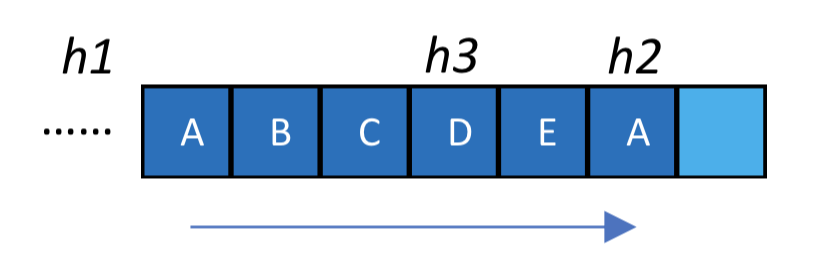
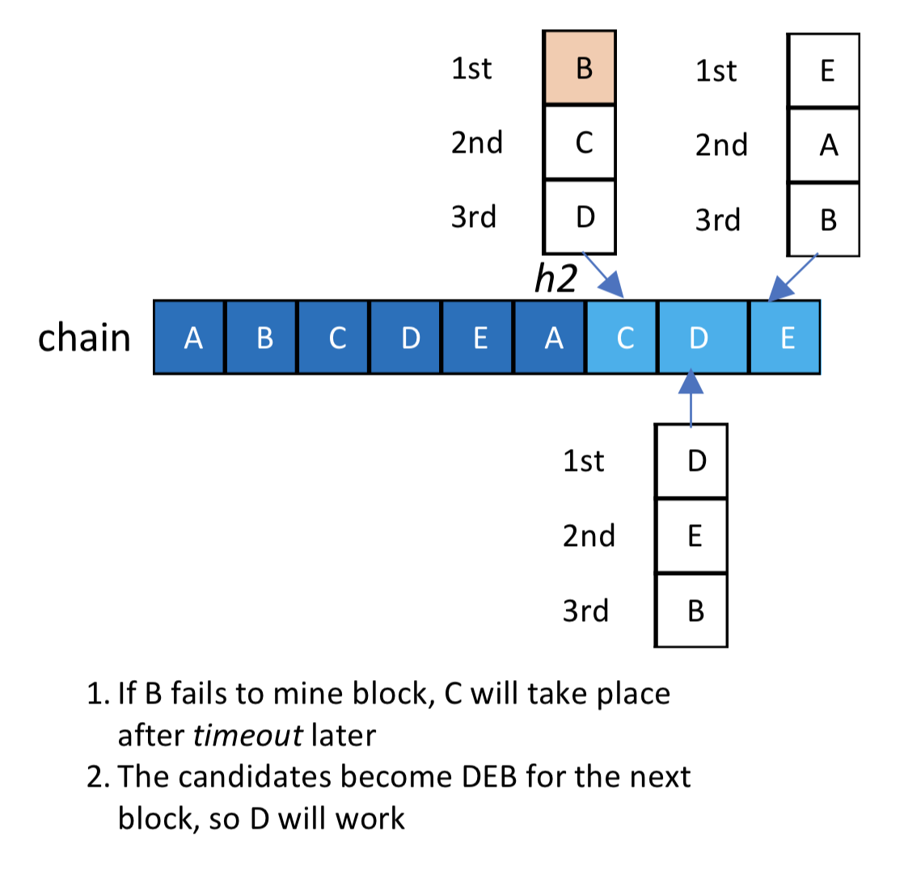

# SCAR：Scalable Consensus Algorithm -- 一种可伸缩共识算法

[点击获取pdf版](https://cloud2.qtum.org/s/8rwT2NQWF3j3MQE)

# 背景介绍

诸如PoW（Proof of Work）、PoS（Proof of Stake）等传统的区块链公式算法，为了减少分叉保证网络的稳定性，通常区块的间隔在10秒以上。例如Ethereum的区块间隔时间是15秒，Qtum是144秒，Bitcoin是10分钟。过高的区块间隔时间，导致了用户等待交易确认的时间较长，不利于实时支付等应用。

而一些联盟链的共识算法，例如EOS的DPoS [1]（Delegated Proof of Stake）、Parity的Aura [2]（Authority Round）等，通过投票选出超级节点来执行共识算法，可以将区块间隔时间降到甚至1秒以内。但这样带来的问题就是block的数量过多，对网络带宽和数据存储都带来了很大的压力。运行一个全节点，甚至仅下载block header的轻节点，都对节点设备的性能有较高的要求。

对于区块链的大多数商业应用而言，如征信上链、商品溯源等，对于区块链的写操作通常是周期性的。即每天的部分时间交易量较大，其余时间交易量小。对于这样的场景，如果始终维持高速的区块产出，对于网络和存储资源都是较大的浪费，而仅需要保证在网络高峰时段系统有较高的性能即可。

因此，我们提出了 SCAR（Scalable Consensus Algorithm）可伸缩共识算法。SCAR的思想是根据区块链网络的负载，动态地调节参数，在高性能和低负载之间找到平衡，从而实现性能可伸缩。

# 相关共识算法介绍

PoW，Bitcoin为代表。节点提供算力，通过大量的计算，产生新的block。算力越高，产生block的速度越快。计算难度每2016个block调整一次，保证在全网算力变化的情况下，block时间间隔保持在10分钟左右。由于block间隔时间长，且每个block的大小限制在 1 MB，所以当交易量大的时候，网络会发生严重拥堵。

PoS，Qtum为代表。节点提供token，通过少量计算，产生新的block。token数额越大，产生block的速度越快。计算难度也会定期调整，保证block时间间隔在144秒左右。PoS相对PoW而言，降低了对算力的要求，节省了能源。但是由于block间隔和block大小限制仍然是固定的，网络的负载固定，无法避免交易量大时候的拥堵。虽然Qtum目前可以使用DGP [3]（Decentralized Governance Protocol）协议手动地去调整block大小限制，但是这种方式略微繁琐。

PoW和PoS中，全网的所有节点都会参与到共识的竞争中来，所以区块间隔不能设置得过小。如果过小，则很容易产生分叉。即，如果计算难度设置得过低，则很容易出现多个节点在同一时刻产出新的block的情况。

DPoS、Tendermint等联盟链共识算法，则通过投票得到的超级节点来执行共识。由于参与共识的节点数较少，则区块间隔可以设置得很小。比如EOS的block间隔就设置成了0.5s。过短的区块间隔对带宽和硬盘都是很大的压力，在交易量少的时候也是一种资源浪费。EOS从今年6月9日上线以来，block数量至今已达1200万，而9年前开始的Bitcoin至今也才50万个block。

# SCAR 共识算法描述

以下将介绍SCAR算法的一种实现方式。这种实现方式在联盟链的基础上，通过交易量来动态地更新区块间隔，从而实现了区块链性能的可升缩。需要注意的是，SCAR算法的核心思想是根据负载动态地调整区块链的性能，所以实现方式并不局限于本文所提出的这种，更多的实现有待进一步地探索。

SCAR共识算法由三个步骤组成：
>   1.	统计投票得到所有超级节点。
>   2.	根据网络负载计算block间隔。
>   3.	间隔时间到后，超级节点按照优先级产出block，一旦一个新的block产出，回到步骤1。

SCAR共识算法的优点在于：
>   1.	由超级节点执行共识，block间隔可以极大程度缩短，交易确认快。
>   2.	block间隔根据网络负载动态调整，空闲时候间隔变长，降低带宽和硬盘压力。
>   3.	当低于半数的超级节点出现故障的时候，新的block仍然能够产出，系统鲁棒性强。

以下将分别描述SCAR算法的三个步骤。

## 节点投票

投票选出超级节点可以有多种设计。比如EOS是所有用户都能参与投票，Aura是当前的超级节点可以投票选出下一轮的超级节点。这里我们提出一种基于Qtum DGP协议的投票策略。

区块链初始化时在链上部署 DGP 的智能合约，在合约内初始化了管理席位 admin 和治理席位 gov，均以地址的形式存储。DGP 协议支持在链上通过管理席位 admin 和治理席位 gov的投票，来决定超级节点是否改变。

首先我们对管理席位和治理席位的权限和修改策略做个介绍。管理席位 admin 在决定权限时具有最多的权力，它可以参与投票增加和删除 admin，同时可以投票任命 gov；而 gov只能参与到超级节点的修改投票中。即所有提案只有具备管理席位的 admin地址才能设置，具有治理席位的 gov地址仅可参与超级节点投票。

投票的具体流程如下：
>   1.	收集新的超级节点的提案，向社区公布并收集反馈；
>   2.	根据社区反馈调整超级节点列表，并通过智能合约存储到区块链中，作为新的提案；
>   3.	通过调用 DGP 合约的相应方法，将该提案设置为待投票的提案，此时即开启投票；
>   4.	拥有管理admin和治理gov权限的地址通过向投票合约发送一笔交易来对提案进行投票；
>   5.	若提案未获得足够投票则被否决，不执行修改；
>   6.	若提案通过，新超级节点列表的存储地址会记录进DGP合约，并在一定数量的区块后生效，以防止出现不必要的分叉。
>   7.	节点可以通过 DGP 合约来获取最新的超级节点列表。

综上所述，我们可以在链上设置 DGP 合约，通过 DGP 投票的方式来决定超级节点，并动态地存储和更新授权矿工列表。

## block 间隔

block的间隔需要根据网络的负载情况动态调整，网络空闲时候间隔变长，网络繁忙时候间隔变短，从而实现动态可伸缩。这里我们提出一种block间隔的计算方法，根据近期的交易数量来进行计算，交易多则间隔变短，交易少则间隔变长。

block间隔的计算公式如下：

其中，min_interval 为最小的block时间间隔，max_interval 为最大的block时间间隔。transaction_num 为最近 m 个区块内的平均交易数，这里 m 可以为大于等于1的整数。 m、min_interval 以及 max_interval 通过共识算法预先设定或者智能合约设置。

这样设计公式的意义在于：
>   1.	当交易量 transaction_num 为0时，block间隔将调整为 max_interval，此时将用系统设置的最长间隔时间来尽量在一个区块内打包更多交易，避免了存储空间的浪费；
>   2.	当链上交易量 transaction_num 趋向于无穷大时，block间隔将无限趋近于 min_interval，此时将用系统设置的最短间隔时间来尽可能缓解区块链网络的交易拥塞，使得交易更快地被打包进区块；
>   3.	max_interval 和 min_interval 可以根据实际情况进行设置（例如用户容忍的交易延迟、超级节点的网络环境和存储性能等）。

采用这种根据网络状态动态调节区块出块时间的共识算法 SCAR，可以有效的避免在交易量小时浪费存储空间，也可以在交易量大时增大区块产生速率，及时将交易打包进区块链上，保证交易更快地被确认。链上参数的动态调整也使得区块链系统变得更加灵活，提高治理效率，降低治理难度和代价。

## block 产出

当超级节点和block间隔都确定之后，节点就可以在间隔时间之后轮流产出新的block。

在某一区块链高度上，若超级节点的数量为 n 个，则 SCAR 会为每个超级节点分配不同的出块时间 block_time如下：

其中，parent_block_time 为上一个block的出块时间，block_interval 为动态计算出的区块间隔。timeout 为超时时间，用来防止某些超级节点出现故障长时间无法出块，miner_index 为索引值，在同一区块高度下，不同的授权节点miner_index 不同。下面将对具体的参数设置原因和用途做出解释。

如下图所示，假定有5个被授权的超级节点 A、B、C、D、E，他们的公钥被存储在有序列表中，即上文提及的由 DGP 投票选出并可动态维护的超级节点列表（也即矿工列表）。假定在区块链高度h1时，有序矿工列表是 [pubkey_A, pubkey_B, pubkey_C, pubkey_D, pubkey_E] ，这五个超级节点会轮流创建新的区块。

当创建新区块时，矿工会通过加密算法签名这个区块，然后将签名结果附加到区块中。通过这种方式，其他节点可以通过解密从区块中恢复出矿工的公钥来，从而通过和超级节点列表进行比对来验证该矿工是否有权创建区块。当一条链被大多数矿工签名之后，这条链可以被视作为一条永久的链。例如在上图中，从创世区块到h3高度的链是一条永久的链，因为它已经被它接下来的几位矿工D、E和A签名了。如果任何矿工想要在高度h3下面制造分叉，这一分叉则无法被绝大多数矿工所认同。

共识算法可以有效地避免分叉的发生，但至少需要 n/2+1 位超级节点保持公式算法的正常运行（n 是超级节点数量，n/2 是整数除法）。共识算法对允许创建下一个区块的矿工做出了以下定义：

一个矿工在以下情况可以创建新的区块:
>   1. 它当前是被授权的；
>   2. 最近的n/2个块不是由它创建的。

由上述定义可得到真正被允许创建下一区块的超级节点的方式：从当前矿工列表中去掉为最近 n/2 个块签名的节点即可。例如，在区块高度 h2 上，下一区块的矿工列表如图计算得到。

由上图过程选出了 B、C、D 三个可创建下一区块的节点后，我们只需要将超级节点列表设置为有序列表，指定它们的优先级先后，就可以避免它们为产出下一区块而竞争。公式中的 miner_index 即为排序后的矿工列表的优先级索引，排序更前的超级节点将被分配更早的 block_time，每个超级节点使用被分配的 block_time 创建新的区块，并在 block_time 到来前保持等待状态。

但超级节点模式的联盟链也面临着一个问题：部分节点的故障会导致网络效率骤降甚至瘫痪。为了避免部分节点的故障导致系统停止运行，共识加入以下策略来确保正常出块。我们在系统参数中设置了 timeout ，若一个超级节点由于故障未能成功广播新的区块，则下一个超级节点会在 timeout 时间之后取代它并正常产出区块。如下图所示，在上述5个超级节点的情况下，矿工 B 在产出高度为 h2+1 的区块时发生故障。随后，B 在超级节点列表中的下一位C ，将会在其 parent_block_time 的 block_interval+timeout 时间之后，广播其创建的新区块。

# 总结

SCAR在保证区块链性能的同时，尽可能节省了带宽和硬盘的消耗，并支持动态调整链上参数，相比其他共识算法更加的高效和灵活，在大规模的商业应用中会有更大的优势。

# 参考文献

[1] EOS.IO Technical White Paper v2: Consensus Algorithm (BFT-DPOS). https://github.com/EOSIO/Documentation/blob/master/TechnicalWhitePaper.md, March 16, 2018

[2] Aura - Authority Round - Wiki. https://wiki.parity.io/Aura

[3] Qtum区块链指南. https://docs.qtum.site/zh/Qtum-Blockchain-Guide.html

